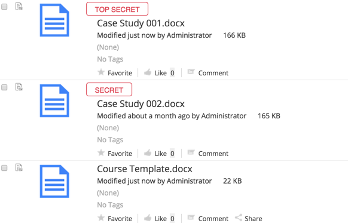

# Classification

With Records Management you can classify files and records so that only users with the required security clearance can view or access them.

Both files and records can be classified using their **Classify** option. There are four classification levels you can assign files and records to, **Top Secret**, **Secret**, **Confidential** and **Unclassified**.

**Note:** These are the default classification levels. Alfresco administrators can set up additional classification levels.

You can't classify a file higher than your own security level. So if your security clearance is Confidential, you can't classify a file as Top Secret.

When a file or record is classified it can only be seen by those with the required security clearance, and the classification level is shown on screen. Users without the necessary security clearance won't have access to it or even know that it's there. When a classified file is declared as a record it retains its classification level.

There are four default clearance levels that can be assigned to users:

-   **Top Secret** - Can see all files and records
-   **Secret** - Can see secret, confidential, and unclassified files and records
-   **Confidential** - Can see confidential and unclassified files and records
-   **No Clearance** - Can see unclassified files and records

**Note:** Alfresco Administrators have Top Secret clearance. All other users are initially assigned to the No Clearance level.

Security clearance levels are enforced for files and records that have been classified. For example, if a record has been classified as Top Secret, then:

-   User 1 \(Top Secret clearance\) - can see and work with the record, following the usual [Alfresco permission rules](http://docs.alfresco.com/5.0/references/permissions_share.html)
-   User 2 \(Confidential clearance\) - doesn't see the record in the File Plan

User 1 would see the following, whereas User 2 would only see the Unclassified file that has no classification label:

-   **[Classification life cycle](../concepts/rm-classification-lifecycle.md)**  
Users with the required security clearance and file permissions can classify and reclassify both files and records.
-   **[Assigning security clearance](../tasks/rm-assign-sc.md)**  
Alfresco Administrators can assign differing security clearance levels to users so that they can't view or access files or records beyond their clearance level.
-   **[Classifying a file](../tasks/rm-classify-file.md)**  
You can classify files so that they can only be viewed or accessed by users who have the required security clearance.
-   **[Classifying a record](../tasks/rm-classify-record.md)**  
You can classify records so that they can only be viewed or accessed by users who have the required security clearance.
-   **[Reclassifying files and records](../tasks/rm-reclassify.md)**  
You can edit classification details as well as reclassifying files and records to downgrade, upgrade, and declassify them.

**Parent topic:**[Using Records Management](../concepts/rm-intro.md)

