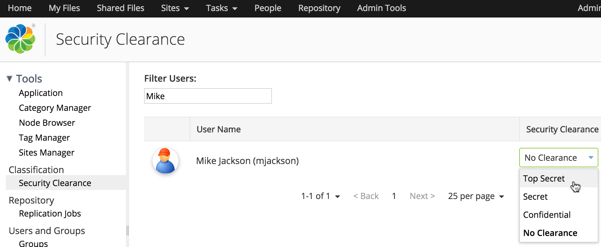

# Assigning security clearance

Alfresco Administrators can assign differing security clearance levels to users so that they can't view or access files or records beyond their clearance level.

There are four default clearance levels you can assign to users. No Clearance is initially assigned to all users and you can change this whenever required.

Security clearance levels are enforced for files and records that have been classified. For example, if a record has been classified as Top Secret, then:

-   User 1 \(Top Secret clearance\) - can see and work with the record, following the usual Alfresco permission rules [Alfresco permission rules](http://docs.alfresco.com/5.0/references/permissions_share.html)
-   User 2 \(Confidential clearance\) - doesn't see the record in the File Plan

**Note:** You need to have the Alfresco Administrator role to set security clearance. You can't change the clearance level of Alfresco Administrators.

1.  Click **Admin Tools** and then click **Security Clearance**.

    Users are shown with their current security clearance.

    -   **Top Secret** - Can see all files and records
    -   **Secret** - Can see secret, confidential and unclassified files and records
    -   **Confidential** - Can see confidential and unclassified files and records
    -   **No Clearance** - Can see unclassified files and records
    You can find the user you want by typing their name in the **Filter Users** box.

    **Tip:** You can also sort users by clicking **User Name** and view a user profile by clicking a user name.

2.  To change a user's security clearance, select the required level from the Security Clearance menu and click **OK** when asked to confirm.

    

    The user's security clearance is now updated.

**Parent topic:**[Classification](../concepts/rm-classification.md)

