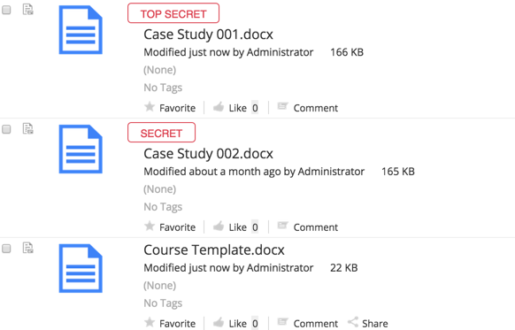

# How security controls work

Both the predefined Classification security group and any custom security groups function in largely the same way, with a few important differences.

In both cases you can apply security marks to both records in a Records Management site, and files in a standard Alfresco site. These same marks are applied to users to set their security clearance levels.

When you classify a file or record using their **Classify** option, the Classify Content screen is split into two sections. The top part is for setting classification and the bottom part for applying additional security marks. You can apply both classification and additional security marks to files \(or records\) at the same time.

**Note:** Standard [Alfresco permissions](http://docs.alfresco.com/5.1/references/permissions_share.html) and [Records Management permissions](../tasks/rm-set-permissions.md) continue to apply as well as any additional classifications.

**Classification security group**

There are four classification levels you can [apply to files and records](../tasks/rm-classify-record.md):

-   **Top Secret**
-   **Secret**
-   **Confidential**
-   **Unclassified** \(typically used to differentiate a file or record that used to be classified, or will become so in future\)

There are three clearance levels that can be [assigned to users](../tasks/rm-assign-sc.md):

-   **Top Secret** - Can see files and records with any classification level
-   **Secret** - Can see secret, confidential and unclassified files and records
-   **Confidential** - Can see confidential and unclassified files and records

**Note:** The default Alfresco Administrator has Top Secret clearance. All other users have No Clearance until their clearance is changed.

You can't classify a file higher than your own security level. So if your security clearance is Confidential, you can't classify a file as Top Secret.

Security clearance levels are enforced for files and records that have been classified. For example, if a record has been classified as Top Secret, then:

-   User 1 \(Top Secret clearance\) - can see and work with the record
-   User 2 \(Confidential clearance\) - doesn't see the record in the File Plan

User 1 would see the following, whereas User 2 would only see the Unclassified file that has no classification label:

When you set security classification for a file or record you must record a reason for the classification. Downgrade and declassification schedule option give additional control over the classification lifecycle.

**Custom security groups**

You can create an unlimited number of security groups, which in turn can contain an unlimited number of security marks. The marks are then [applied to files and records](../tasks/rm-classify-record.md) and [assigned to users](../tasks/rm-assign-sc.md).

When you create a new security group there are three clearance types available:

-   **All security marks applied to the content**= Users must have all security marks from the group that are applied to a file to see that file.

    Example: A Security Group named Training contains security marks of Media and Data Handling. To see a file marked as both Media or Data Handling, then a user must have both Media and Data Handling clearance.

-   **One or more marks applied to the content** = Users must have at least one of the security marks from the group that are applied to a file to see that file.

    Example: A Security Group named Nationality contains security marks of UK, US, and Aus. To see a file marked as UK and US, then a user must have UK and / or US clearance.

-   **The same or greater clearance than that of the content** = Security marks are ranked in the order they're created. The mark created first in a security group has the greatest clearance, the one created last the least clearance.

    Example: The predefined Classification group has marks of Top Secret, Secret, and Classified. To see a file classified as Secret, then the user must have Secret or Top Secret clearance.

Using the above examples, if a record has been classified as Media, Data Handling, US, and UK, then:

-   User 1 \(Media, Data Handling, and UK\) - can see and work with the record
-   User 2 \(Media and UK\) - doesn't see the record in the File Plan

**Note:** Files and records aren't visibly labelled with custom security marks in the same way as they are with security classification marks.

**Parent topic:**[Security controls](../concepts/rm-security.md)

