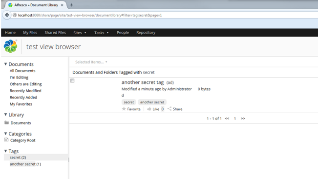

# Records Management FAQs

Here are the answers to some frequently asked questions about Records Management.

-   [What are the differences between a DoD 5015.2 and standard Records Management sites?](rm-user-faqs.md#dod-differences)
-   [How does classification interact with standard Records Management permissions?](rm-user-faqs.md#classification-permissions)
-   [Why can't I see a classified file?](rm-user-faqs.md#classification-hidden)
-   [Why are the tags showing more files than I can see?](rm-user-faqs.md#tags)
-   [Why can't I upload a file when I have the required permissions?](rm-user-faqs.md#duplicate)
-   [Are RSS feeds secure?](rm-user-faqs.md#rss)
-   [Why isn't hot backup working properly?](rm-user-faqs.md#delete)
-   [Records uploaded using CIFS, WebDav, or FTP don't have any content?](rm-user-faqs.md#cifs)

**What are the differences between a DoD 5015.2 and standard Records Management sites?**

When you create a Records Management site you can choose to create a DoD 5015.2 site or a standard site. If your organization is required to meet DoD 5015.2 compliance, then select **DoD 5015.2-STD**. Records on a DoD 5015.2 site have additional madatory metadata the must be completed. Mandatory metadata includes the originator, the originating organization, the publication date, the destroy action.

[back to top](rm-user-faqs.md#)

**How does classification interact with standard Records Management permissions?**

There are two levels of interaction between classification and permissions. To view a classified file or record you need to have read permissions for that file and the required clearance level. To classify a file or record, or edit the classification, you need to have read and file permission and clearance to use the classification level\(s\) involved.

[back to top](rm-user-faqs.md#)

**Why can't I see a classified record when I have the required clearance?**

Having the required clearance level isn't all that's needed to view a classified record. You also need to have the required permissions, including but not restricted to permission to view the category, permission to view the folder, and permission to view the record.

[back to top](rm-user-faqs.md#)

**Why are the tags showing more files than I can see?**

Depending on your security clearance level, some files or records might be hidden from you in Alfresco. The tags link displays the total number of files that have that tag, but when you click it you'll only be able to see those that you have access to.

[back to top](rm-user-faqs.md#)

**Why can't I upload a file when I have the required permissions?**

In each folder you can't have multiple files of the same name. You might have permissions to add files, but may not have security clearance to see, for example, files that have been classified as Top Secret. If you try to upload a file when there is already one in the folder, even if you can't see it, you'll receive a message: Unexpected error occurred during upload of new content.

[back to top](rm-user-faqs.md#)

**Are RSS feeds secure?**

RSS feeds are secure, but the login credentials are stored by the browser you're using and not Alfresco. As such it's recommended that you close your browser after logging out of Alfresco and / or lock your computer while you're away from it.

[back to top](rm-user-faqs.md#)

**Why isn't hot backup working properly?**

The default behavior for classified records is "immediate delete", which means that content is deleted immediately, and will not be included in a hot backup. If you have performed a hot backup and you try to retrieve content that was deleted, a Requested resource is not available message is displayed.

[back to top](rm-user-faqs.md#)

**Records uploaded using CIFS, WebDav, or FTP don't have any content?**

There's a known issue that when users with the Records Management User role and Read and File permissions add a record using CIFS, WebDav, or FTP, the record is added but it's content is removed. Other issues may also occur. It's recommended that users in this situation are given an alternate Records Management role to resolve the issue.

[back to top](rm-user-faqs.md#)

**Parent topic:**[Alfresco Records Management](../concepts/welcome-rm.md)

