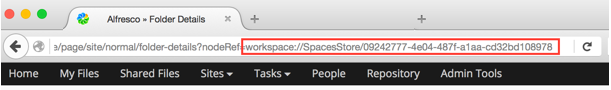

# Upgrading easy access records from pre-2.3.0.8 versions

If you upgrade from a pre-2.3.0.8 version of Records Management, then and additional webscript needs to be run so that easy access records \(previously known as in-place records\) created in pre-2.3.0.8 sites are shown in the search results of users without Records Management permissions.

It can be run as a one-off operation to convert all existing records or, for better performance on larger repositories, it can also be run on a user-defined number of records.

**Note:** Easy access records created on Records Management 2.3.0.8 and later are shown without running the webscript.

There are four paramaters available for the webscript.

-   *batchsize* \(mandatory\) - the batch size to process records in. So for example, if you enter batchsize=100, then records will be processed in consecutive batches of 100.
-   *maxProcessedRecords* \(optional\) - the maximum number of records to be processed. If unspecified, this value defaults to that of the *batchsize*. If set to 0, all records are processed.
-   *export* \(optional\) - "true" or "false" \(the default is false\). If true is selected then a list of processed records is exported in csv format. The list shows the file name and file node reference.
-   *parentNodeRef* \(optional\) - process records in a specified folder and its sub-folders. See step 3 for how to get the *parentNodeRef* node reference.

You need Alfresco Administrator permissions to run the webscript.

1.  Paste or type *http://<server name\>:<server port\>/alfresco/s/api/rm/rm-dynamicauthorities* into your browser.

2.  Append your required parameters, for example:

    -   To process 50 records in one batch of 50 type *http://<server name\>:<server port\>/alfresco/s/api/rm/rm-dynamicauthorities?batchsize=50*
    -   To process 100 records in two batches of 50 type *http://<server name\>:<server port\>/alfresco/s/api/rm/rm-dynamicauthorities?batchsize=50&maxProcessedRecords=100*
    -   To process all pre-2.3.0.8 records in batches of 100 type *http://<server name\>:<server port\>/alfresco/s/api/rm/rm-dynamicauthorities?batchsize=100&maxProcessedRecords=0*
    -   To process 10 records in one batch of 10 with csv output type *http://<server name\>:<server port\>/alfresco/s/api/rm/rm-dynamicauthorities?batchsize=10&maxProcessedRecords=10&export=true*
3.  Press Enter to run the webscript. You may be prompted for your system username and password.

    **Note:** If you enter a large batch number then your browser may time out. The process will continue running in the background and details will be recorded in the server logs. As such, it's recommended that you set a *maxProcessedRecords* or use *parentNodeRef* to process a folder at a time.

    **Tip:** To get the *parentNodeRef* for a folder go to its parent folder, then hover over the folder and select **View Details**. The node ref will be shown in the browser address.

    

4.  Results and/or errors are reported as a JSON-formatted string, or a CSV file if you use the *export* parameter. Processed records are shown in the alfresco.log as below:

    ```
    2016-09-16 13:46:44,409 INFO  [org.alfresco.repo.web.scripts.roles.DynamicAuthoritiesGet] [http-apr-8080-exec-6] Processing – BEGIN
    [ output cut ]
    2016-09-16 13:46:47,131 INFO  [org.alfresco.repo.web.scripts.roles.DynamicAuthoritiesGet] [http-apr-8080-exec-6] Processing record file149 (2016-1474021730514).txt - BEGIN
    2016-09-16 13:46:47,150 INFO  [org.alfresco.repo.web.scripts.roles.DynamicAuthoritiesGet] [http-apr-8080-exec-6] Processing record file149 (2016-1474021730514).txt - END
    2016-09-16 13:46:47,152 INFO  [org.alfresco.repo.web.scripts.roles.DynamicAuthoritiesGet] [http-apr-8080-exec-6] Processing record file150 (2016-1474021731516).txt - BEGIN
    2016-09-16 13:46:47,174 INFO  [org.alfresco.repo.web.scripts.roles.DynamicAuthoritiesGet] [http-apr-8080-exec-6] Processing record file150 (2016-1474021731516).txt - END
    2016-09-16 13:46:47,238 INFO  [org.alfresco.repo.web.scripts.roles.DynamicAuthoritiesGet] [http-apr-8080-exec-6] Processing - END
    2016-09-16 13:46:47,238 INFO  [org.alfresco.repo.web.scripts.roles.DynamicAuthoritiesGet] [http-apr-8080-exec-6] Processed first 100 records.
    ```


**Parent topic:**[Upgrading Records Management](../tasks/rm-upgrade-proc.md)

