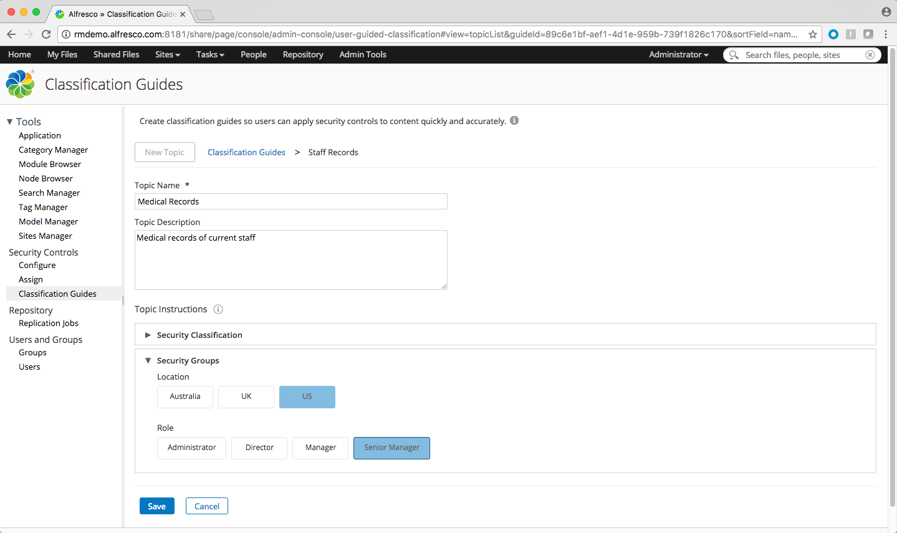

# How classification guides work

You'll usually have a number of common classification requirements for different types of content. For example, all staff records may require the same security levels to access them.

Instead of setting these individually, you can [create classification guides](../tasks/rm-create-guide.md) to use as templates for classifying content quickly and accurately.

You can create as many classification guides as you want and make them as complex or as simple as you need.

Each guide is made up of one or more topics. A topic can contain further subtopics, or a set of instructions. If you select to add instructions you can choose security classification, including a classification agency and reasons and downgrade and declassification schedules, as well as any additional security marks that are set up.

You can choose to make a guide available for use in classification by setting it to **On**, or to leave it **Off** until you're ready for it to be used.

When people are [classifying content](../tasks/rm-classify-record.md) they can select to **Add Instructions** and browse through the classification guides to find the instructions they want. When the instructions are applied to content then all the security classifications and controls the instructions contain are automatically applied to that content.

**Example**

The following example shows a classification guide for Staff Records. This guide contains a topic named Medical Records which has has instructions to include the US and Senior Manager security marks.

If a file was classified using these instructions then it would only be visible to users who have security clearance for US and Senior Manager levels.

**Parent topic:**[Security controls and classification](../concepts/rm-security.md)

