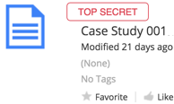

# Classification life cycle

Users with the required security clearance and file permissions can classify and reclassify files, records, folders, and categories.

1. Alfresco Administrator creates security controls in the Alfresco Admin Tools \(Security Controls \> Configure\) - the classification security group is predefined.

2. Alfresco Administrator assigns security clearance level to a user in the Alfresco Admin Tools \(Security Controls \> Assign\).

3. You are given or already have the site and file permissions needed to edit [files](http://docs.alfresco.com/5.1/tasks/permissions_share.html)/[records](../tasks/rm-usergroups-add.md).

4. Select to classify a file, record, folder, or category.

5. Selects security classification and/or security marks.

6. The classified item is only seen by those with the required security clearance.

7. You can reclassify the item as required, following the Downgrade Schedule or Declassification Schedule where appropriate.

**Parent topic:**[Security controls and classification](../concepts/rm-security.md)

