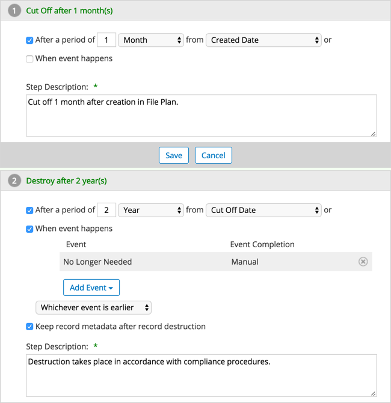

# Example of a retention schedule

Retention schedules can be set up to account for all different kinds of operational processes.

Here is an example of the steps in a fairly straightforward retention schedule.

Records that are associated with this schedule will be cut off after one month in the File Plan. They will then be retained in the File Plan for two years or until they're no longer needed, whichever comes first. At that point they will then be destroyed.

**Parent topic:**[Retention schedules](../concepts/rm-dispschedule.md)

