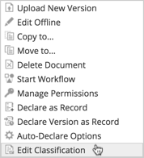

# Classification life cycle

If you have the required security clearance and file permissions can classify and reclassify files, records, folders, and categories.

1. An Alfresco Administrator can create security controls. Go to **Admin Tools** \> **Security Controls** \> **Configure** \> **Security Marks**.

2. An Alfresco Administrator assigns security clearance levels to a user. Go to **Admin Tools** \> **Security Controls** \> **Configure** \> **Assign**.

3. You are given the file permissions needed to edit [files](http://docs.alfresco.com/5.1/tasks/permissions_share.html)/[records](../tasks/rm-usergroups-add.md).

4. Select to classify a file, record, folder, or category.

5. Selects security classification and/or security marks.

6. The classified item is only seen by those with the required security clearance.

7. You can reclassify the item as required, following the Downgrade Schedule or Declassification Schedule where appropriate.

**Parent topic:**[Security Marks and Classification](../concepts/rm-security.md)

