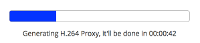

# Viewing media

Alfresco Media Management provides additional information and features in Alfresco when you view image or video files.

1.  Select an image or video in the Document Library, as you would normally in Alfresco, by clicking the thumbnail or name, to view it in the file preview screen.

2.  You will see additional preview options relating to the image or video:

    -   **Renditions** panel, which shows the different options that are available for this image or video. These might include a low resolution thumbnail, a medium size JPEG file for an image, or H.264 proxy for video.
    -   PBCore additions to the **Properties** panel, including the duration of a video, data rate, frame rate, and sampling rate.
    -   IPTC additions in the **Properties** panel, including informational metadata like IPTC contact information, IPTC scene codes, headline and description.

        **Note:** IPTC metadata is mapped to existing tags. For example, the IPTC Caption/Description is also displayed on the Document Library view of an image or video, if this field is present.

3.  If you are the first user to open a video file, you will see a progress bar indicating the time estimated for the video to load.

    For example: 

    **Note:** This progress bar is not visible if AWS Elastic Transcoder is set up in your organization to process your video content.

    The progress bar is visible only on the first upload of a video. After it has been loaded once, this video is available to all users to view, without delay.

    CAUTION:

    Creating video proxies \(when viewing videos for the first time\) is very resource intensive. You might experience very slow performance while this is occurring unless your Alfresco administrator has configured additional resources to process this workload.

**Parent topic:**[Using Media Management](../concepts/mm-using.md)

