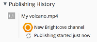

# Publishing media

Alfresco Media Management provides publishing options in Alfresco.

1.  In the Document Library, click the title of the file you want to view.

2.  Select Publish from the Document Actions panel and choose the channel you want to publish to \(for example, Brightcove\). You can optionally add a message.

    This option allows you to publish content to Brightcove and CloudFront, as long as your Alfresco administrator has set up publishing channels.

3.  The Publishing History panel in the preview screen updates with the version of the media and the channel that you selected to publish the media.

    For example: 

**Parent topic:**[Using Media Management](../concepts/mm-using.md)

