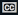

# Manipulating video

Alfresco Media Management provides features to allow you to edit video files in Alfresco.

1.  Select a video file from the Document Library, as you would normally in Alfresco, by clicking the thumbnail or name, to view it in the file preview screen.

2.  Click the arrow to play the video, and then click the  edit icon.

    -   : Trim the video length. Before clicking this icon you need to move the yellow sliders shown above the video timeline to your preferred start and end times.
    -   Create Copy: click the checkbox before selecting the trim icon to save a copy of the image. The trimmed image is created in the same folder with the name Copy of original, where original is the name of your original image. If more than one copy is taken, the name is Copy x of originalimage, where x relates to the number of copies taken.
    Each time that the video is edited, it is stored as a new version of the original video \(as long as the video is versionable\), unless the Create Copy checkbox is selected.

3.  You can add a comment in the usual way by clicking Add Comment, however with Media Management you can add this to the timeline of the video:

    1.  Click Add Comment while the video is playing.

    2.  Click the From box and click the  current playback position icon, at the point where you want to make a comment.

        You can optionally add an end time, in the format HH:MM:SS:MS.

    3.  When you \(or another user\) next view the video, yellow markers \(timecode markers\) indicate where the timeline comments have been placed.

        When you hover on the yellow marker, the comment is displayed. A new icon, , is now available on the video control bar, which allows you to toggle the comments as subtitles on the video.

**Parent topic:**[Using Media Management](../concepts/mm-using.md)

