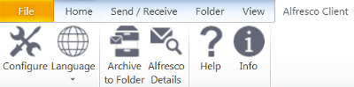

# Configuring Alfresco Outlook Integration in Alfresco Share and in Microsoft Outlook

Configure specific client settings in Microsoft Outlook using the Alfresco Client toolbar tab and server settings in Alfresco Share by using the Share Admin Tools menu.

In Alfresco Share, click **Admin Tools** on the Alfresco toolbar. In the left Tools panel, scroll down and under Email Client there are the following options for configuration:

-   **Email Integration Settings**: view and edit global site, email and document library settings
-   **Email Access Tokens**: view and remove active users
-   **Email Licenses**: view and register server and client licenses
-   **Email System Info**: view version, license, server and installed module information

On the Microsoft Outlook toolbar, there is an Alfresco Client tab, with the following entries:

-   Configure: client configuration and license
-   Language: client display language
-   Archive to Folder: archive directly to a folder
-   Alfresco Details: displays details of a selected archived email
-   Help: Link to Alfresco Outlook Client documentation
-   Info: version and copyright information

-   **[Configuring email integration settings in Alfresco Share](../tasks/Outlook-admin-integration.md)**  
You can configure email integration settings for Alfresco Outlook Integration using Share Admin Tools. These settings define global controls across your enterprise.
-   **[Configuring other settings in Alfresco Share](../tasks/Outlook-admin-integration-1.md)**  
You can view and edit other settings for Alfresco Outlook Integration using Share Admin Tools. These settings define global controls across your enterprise.
-   **[Configuring connection settings in Outlook](../tasks/Outlook-config-server.md)**  
Configure Microsoft Outlook to find and connect to the correct Alfresco server.
-   **[Configuring email archive settings in Outlook](../tasks/Outlook-config-email.md)**  
You can configure Microsoft Outlook to archive email in Alfresco, including archiving emails as links.
-   **[Configuring extended settings in Outlook](../tasks/Outlook-config-extended.md)**  
Configure Outlook extended settings; for example, you can change the display language, Alfresco settings, or drag and drop priorities.
-   **[Importing the configuration template in Outlook](../tasks/Outlook-config-template-setup.md)**  
Set the configuration template to import when the configuration dialog is called for the first time.

**Parent topic:**[Installing and configuring Alfresco Outlook Integration](../concepts/Outlook-install-intro.md)

