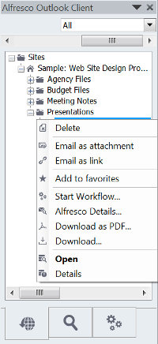

# Managing files using the Alfresco sidebar

In Outlook, use the Alfresco sidebar to browse and work with your connected Alfresco repository.

1.  Go to the **Alfresco Client** tab on the Outlook toolbar and click **Configure \> Extended**.

2.  Select Show Alfresco Outlook Client and click **OK**.

    This option displays a new window on the right side of the screen, called Alfresco Outlook Client.

3.  Use the context menu in the Alfresco sidebar by right-clicking any folder or document:

    

4.  Choose whether to see the whole repository in this view, or to limit the view to certain sites only \(All Sites, My Sites or Favorites\).

5.  Drag and drop files into the Alfresco sidebar. A number of options are available, depending on what has been set in the configuration settings.

    The options available to you are shown in the right-click context menu. See [Configuring extended settings in Outlook](Outlook-config-extended.md) for more information on configuration settings.

-   **[Viewing options in the Alfresco sidebar](../tasks/Outlook-email-manager-views.md)**  
Set preferences, drag and drop, search, start workflows, and use the context menu in the Alfresco sidebar.

**Parent topic:**[Using Alfresco from Microsoft Outlook](../concepts/Outlook-intro_v1.md)

