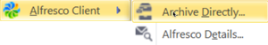

# Archiving emails in Outlook

Set automatic archiving using the Alfresco Outlook Client, or archive emails directly.

Directly archive an email by using one of these methods:

-   Drag and drop the email into a folder in your chosen site in Alfresco sidebar
-   Right-click the email, and select Alfresco Client and Archive Directly: 
-   Navigate to the Alfresco Client toolbar in Outlook, and select Archive to Folder

If you drag and drop into a folder, you are not prompted for a location for the email. If you right-click or navigate to the toolbar, a dialog window opens, where you select the Alfresco site and define archive settings:

1.  Archive an email manually by using one of the methods specified \(either right-click or navigate to the toolbar\).

2.  In the Archive Directly dialog, select an Alfresco site and folder from the directory tree, or select a folder and site from Previously selected folders.

    Alternatively, click **Search** to browse to find a folder and site.

3.  Click either **Use default settings** or **Define custom settings** to define your archive settings.

4.  If you have specified in your configuration settings to add metadata when archiving an email, the Add Metadata dialog appears.

    See [Adding metadata to email during archiving in Outlook](Outlook-using-archive-metadata.md) for more information about adding metadata.

Your email is successfully archived, and is now marked with the Alfresco icon in Outlook: 

**Parent topic:**[Using Alfresco from Microsoft Outlook](../concepts/Outlook-intro_v1.md)

