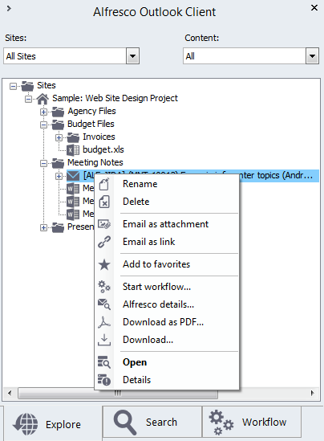
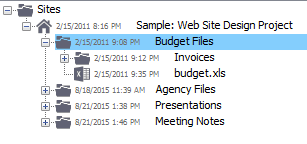

# Explore options in the Alfresco sidebar

Work with your files and folders using the Alfresco sidebar.

1.  Go to the **Alfresco Client** tab on the Outlook toolbar and click **Show Sidebar**.

    This option displays a new window on the right side of the screen, called Alfresco Outlook Client.

2.  Click Explore from the sidebar.

    Explore is the default tab and allows you to work with your files and folders in Alfresco. Choose which sites and content you wish to see. You can see the full repository in this view, or limit the view to certain sites only \(All Sites, My Sites or Favorites\). You can also choose to view all content, or only your favourite files or folders.

3.  Drag and drop files into the repository. A number of options are available, depending on your configuration settings.

    The options available to you are shown in the right-click context menu. For example, if you have selected a Microsoft Office file, you can edit this online in addition to other standard options. See [Configuring extended settings in Outlook](Outlook-config-extended_v2.md) for more information on configuration settings.

4.  Open folders and view files from the Explore tab. Depending on your configuration settings and the number of files in your repository, you have the option to see additional files by clicking 

5.  Right click any folder or file for additional options:

    

6.  Use Configure \> Extended from the Alfresco Client toolbar to dynamically change the way that the files and folders are displayed.

    For example, this format is displayed when Folder sort order is set to date modified \(ascending\), with Date sort display options set to date/time and subject:

    

    **Note:** Right click a folder and select Sort by and your chosen option to dynamically sort the contents of a folder.

**Parent topic:**[Managing files using the Alfresco sidebar](../tasks/Outlook-email-manager_v2.md)

