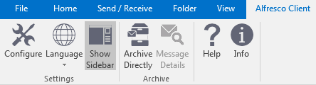

# Configuring Outlook settings in Alfresco and Microsoft Outlook

Configure Outlook settings in Alfresco Share using the Share Admin Tools menu, in Microsoft Outlook using the Alfresco Client toolbar, or by editing configuration files directly.

In Alfresco Share, as an administrator, click **Admin Tools** on the Alfresco toolbar. In the left Tools panel, scroll down and under Email Client there are the following options for configuration:

-   Email Metadata Settings: custom metadata and list view settings
-   Email Integration Settings: server and client setup, upload restrictions and email settings
-   Email Access Tokens: view and remove active users
-   Email Licenses: view and register server and client licenses
-   Email System Info: view version, license, server and installed module information

**Note:** The URL is:

```
http://localhost:8080/share/page/console/admin-console/mail-customization-config
```

where `localhost:8080` is your Alfresco server and port number.

On the Microsoft Outlook toolbar, there is an Alfresco Client tab, with the following entries:



-   Configure: client configuration and license
-   Language: client display language
-   Show Sidebar: show the Alfresco repository window
-   Archive Directly: archive directly to a folder
-   Message Details: displays details of a selected archived email
-   Help: Link to Alfresco Outlook Client documentation
-   Info: version and copyright information

**Note:** Not all settings can be configured using the Alfresco Client toolbar.

-   **[Configuring Outlook metadata and list view settings in Alfresco](../tasks/Outlook-admin-metadata-settings.md)**  
You can configure metadata and list view settings for Alfresco Outlook Integration using Share Admin Tools. These settings define global controls across your enterprise and are applied immediately.
-   **[Configuring Outlook email settings in Alfresco](../tasks/Outlook-admin-integration_v2.md)**  
You can configure email integration settings for Alfresco Outlook Integration using Share Admin Tools. These settings define global controls across your enterprise and are applied immediately.
-   **[Configuring other Outlook settings in Alfresco](../tasks/Outlook-admin-integration-1.md)**  
You can view and edit other settings for Alfresco Outlook Integration using Share Admin Tools. These settings define global controls across your enterprise.
-   **[Configuring connection settings in Outlook](../tasks/Outlook-config-server.md)**  
Configure Microsoft Outlook to find and connect to the correct Alfresco server.
-   **[Configuring email archive settings in Outlook](../tasks/Outlook-config-email_v2.md)**  
You can configure Microsoft Outlook to archive email in Alfresco, including archiving emails as links.
-   **[Configuring extended settings in Outlook](../tasks/Outlook-config-extended_v2.md)**  
You can configure Outlook extended settings; for example, change the display language, Alfresco settings, or drag and drop priorities.
-   **[Configuring views in Outlook](../tasks/Outlook-config-views.md)**  
You can configure the look and feel of the Alfresco sidebar.
-   **[Importing the configuration template in Outlook](../tasks/Outlook-config-template-setup_v2.md)**  
Set the configuration template to import when the configuration dialog is called for the first time.

**Parent topic:**[Installing and configuring Alfresco Outlook Integration](../concepts/Outlook-install-intro.md)

