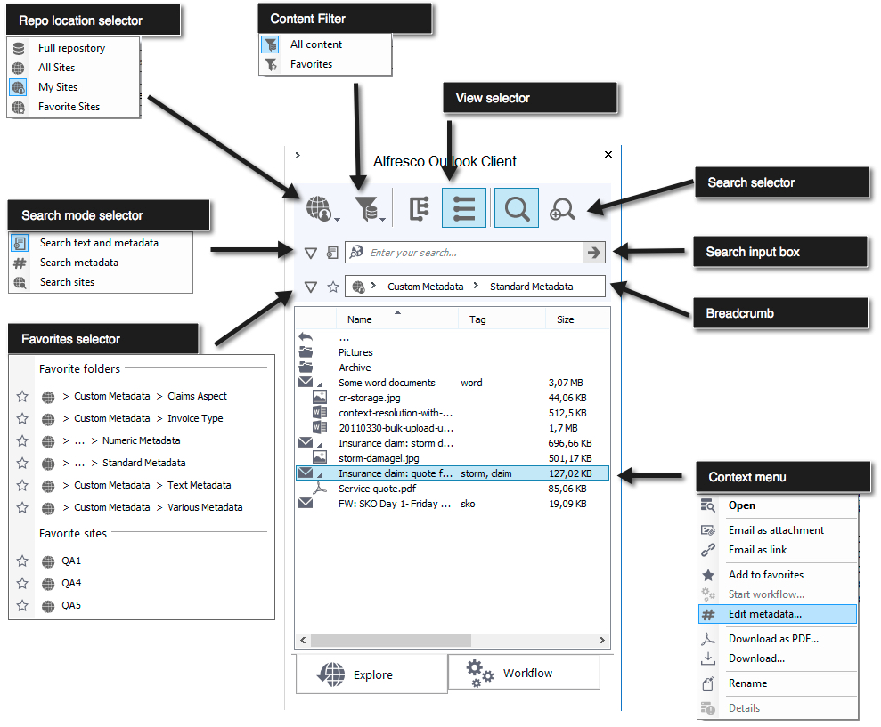
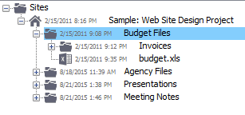

# Explore options in the Alfresco sidebar

Work with your files and folders using the Alfresco sidebar.

1.  Click the Explore tab from the Alfresco Outlook Client sidebar.

    

    Explore is the default view and allows you to work with your files and folders in Alfresco.

2.  Repo location selector: choose which sites and content you wish to see. You can see the full repository in this view, or limit the view to certain sites only \(All Sites, My Sites or Favorite Sites\).

3.  Content filter: choose to view all content, or only your favourite files or folders.

4.  View selector: choose whether to see your content in a tree view or a list view.

5.  Search selector: choose between a simple or complex search \(if this is configured\).

    1.  Search mode selector: choose whether to search text and metadata, or just metadata, or search at a site level.

    2.  Enter your search criteria.

        Type directly in the search box, where it says Enter your search.

        You can choose favorite folders or sites to filter the search.

    3.  The content that matches your criteria is displayed below the search box.

    4.  Context menu: there are a number of actions to apply for each search result. These include:

        -    Send an email, with this result attached \(applicable to files only\)
        -    Send an email, with this result embedded as a link
        -    Mark as a favorite
        -    Add metadata for the file or folder. This opens the metadata dialog that was displayed when the file was filed in Alfresco.
6.  Drag and drop files into the repository. A number of options are available, depending on your configuration settings.

    The options available to you are shown in the right-click context menu. For example, if you have selected a Microsoft Office file, you can edit this online in addition to other standard options. See [Configuring extended settings in Outlook](Outlook-config-extended_v2.md) for more information on configuration settings.

7.  Open folders and view files from the Explore tab. Depending on your configuration settings and the number of files in your repository, you have the option to see additional files by clicking 

8.  Use Configure \> Extended from the Alfresco Client toolbar to dynamically change the way that the files and folders are displayed.

    For example, this format is displayed when Folder sort order is set to date modified \(ascending\), with Date sort display options set to date/time and subject:

    

    **Note:** Right click a folder and select Sort by and your chosen option to dynamically sort the contents of a folder.

**Parent topic:**[Managing files using the Alfresco sidebar](../tasks/Outlook-email-manager_v2.md)

