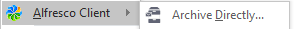
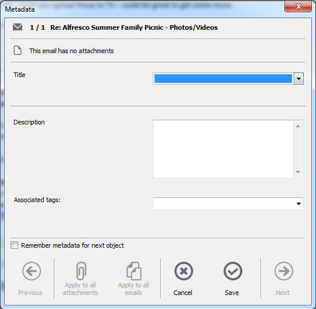
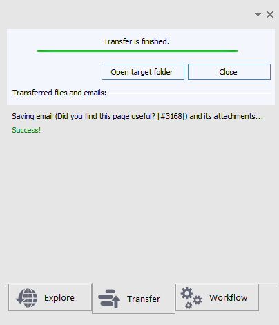

# Archiving emails in Outlook

You can archive emails to an Alfresco site or folder in a number of ways.

-   Drag and drop the email into a folder in your chosen site in the Alfresco sidebar
-   Right-click the email, and select Alfresco Client and Archive Directly: 
-   Select Alfresco Client \> Archive Directly from the Outlook toolbar

If you right-click or navigate to the toolbar, a dialog window opens, where you select the Alfresco site and define archive settings.

**Note:** If you drag and drop to a folder, you're not prompted for a location for the email.

1.  Archive an email manually by using one of the methods specified \(either right-click or navigate to the toolbar\).

2.  In the Archive Directly dialog, select an Alfresco site and folder from the directory tree, or select a folder and site from Previously selected folders.

3.  You might see a Metadata dialog, if this has been configured by your system administrator. Enter the information needed for archiving the email.

    For example, you might need to enter a title, description and any associated tags. If you're filing a number of emails, you can check **Remember metadata for next object** to retain your settings for the next time you archive an email.

    Here is an example Metadata dialog:

    

    -   The first line indicates the number of emails that you are archiving \(in this case, 1 / 1 is 1 of 1 emails\), and the title of the current email. If you're archiving more than one email, the Next and Previous options are enabled so that you can page between the emails.
    -   If you have email attachments, the Apply to all attachments option is enabled and you can apply any metadata you enter to all attachments related to that email.
    -   If you're archiving more than one email, the Apply to all emails option is enabled and you can apply the same metadata to all emails that are being archived.
    -   Select Save to save your changes.
    -   If you copy a single file to a folder in Alfresco, and then choose the Cancel option to stop the transfer, the file will still transfer into Alfresco. The Cancel action works best when transferring multiple files. The last transferred file remains in Alfresco, however the other files are not transferred.
    -   If you select Send to background during the transfer, the window is hidden and you can view the progress in a Transfer tab in the Alfresco sidebar.

        During the file transfer, you can cancel the file transfer from this tab, or bring the window back to the foreground.

        After the file transfer is complete, you can open the target folder in the Alfresco sidebar, or click Close to close the tab:

        

        The Transfer tab color is green if the transfer progresses successfully, or red if there are issues. For file transfer issues, a link to the log is displayed in the tab content.

        **Note:** It is not possible to start another upload while the background transfer is in progress.

    A check is made for duplicates during email archiving. The ID of each email is checked to see if it has already been saved in the same folder or on the same site. If the email has already been saved, a message is displayed saying that the message already exists in the repository, giving details of who archived the file, when it was archived, and the path of the archived file. You can open or overwrite the previously archived email, or cancel the archive operation.

    **Note:** Overwriting the previously archived email is possible only if the email to be overwritten is in the same folder and overwriting has been enabled in the Alfresco Admin Tools settings. See [Configuring Outlook email settings in Alfresco](Outlook-admin-integration_v2.md) from more information.

    When an email is archived, it is usually identified with an Alfresco icon in the Outlook inbox: 

    An email that is archived as an attachment can be opened directly by double-clicking the email in Outlook. The email opens in a new window and can be read normally. An email that is archived as a link can be loaded into Outlook by clicking the link in the email.

    See [Outlook metadata settings](Outlook-config-metadata.md) for metadata configuration guidance.

**Parent topic:**[Using Alfresco from Microsoft Outlook](../concepts/Outlook-intro.md)

