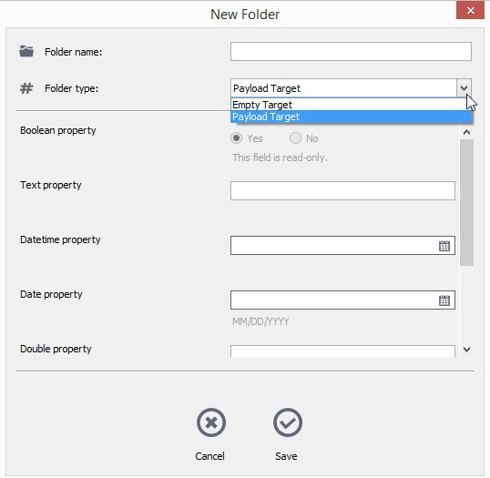

# Archiving folders in Outlook

You can create folders in the Alfresco Outlook Client and assign metadata to these folders, similar to when archiving emails.

You can create different types of folders within a particular location and assign different sets of metadata depending on the type of content the folder contains. You may be able to select different metadata settings, if configured by your IT team. This allows you to select the best metadata fields from a list in the metadata dialog.

1.  Click the Explore tab from the Alfresco sidebar.

2.  Select a site and folder from the directory tree, right-click the context menu then select Create folder.

    The system displays a folder metadata dialog. The default folder metadata scheme and associated properties are shown.

3.  In the New Folder dialog, enter the information needed to create the folder.

    For example, you may be able to select different folder metadata settings, if configured by your IT team. Select Payload Target in the Folder type list to see the fields you can apply to the new folder.

    Here is an example folder metadata dialog:

    

    -   In the Folder name field, enter a name for the new folder.
    -   If your IT team has configured multiple folder metadata options for a specific upload location, the Folder type field shows a list of options and you can pick the most appropriate metadata depending on the content you're archiving. Note that some fields may be read-only, such as the Boolean property field, and you can't change them.
    -   Select Save to create the new folder with defined folder type and properties.
    The system updates the navigation panel and shows the new folder.

    See [Outlook metadata settings](Outlook-config-metadata.md) for folder metadata configuration guidance.

**Parent topic:**[Using Alfresco from Microsoft Outlook](../concepts/Outlook-intro.md)

