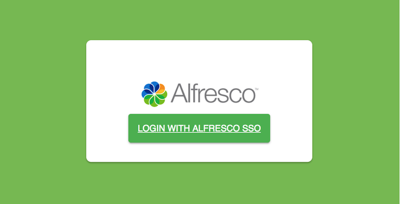
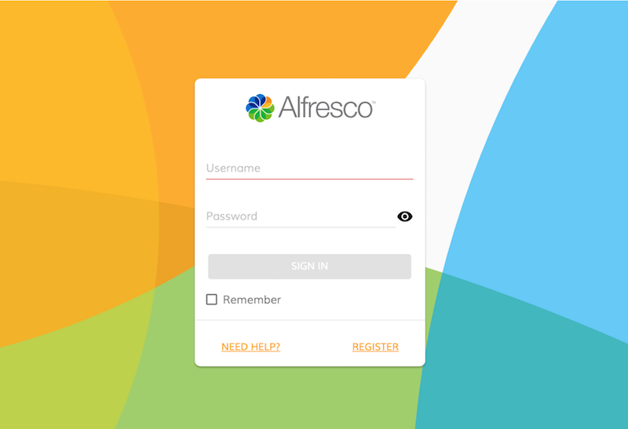
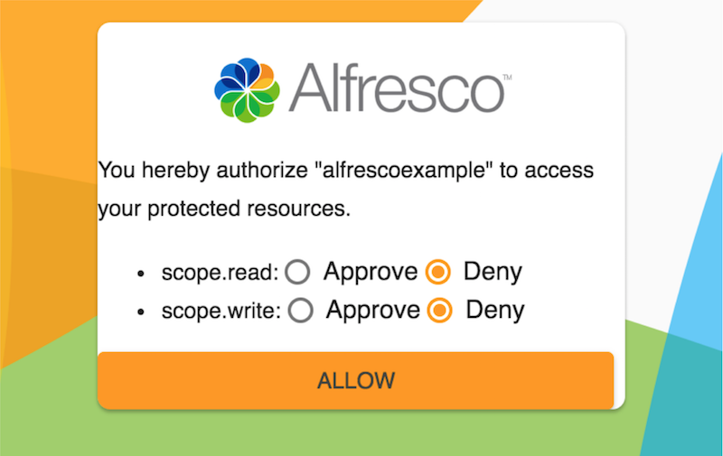

# Using the Alfresco OAuth 2 Authorization server

The Alfresco OAuth 2 Authorization server can be used as part of the OAuth 2 flows. The server needs to be used in conjunction with the LDAP sync for users from the Alfresco Content Services LDAP directory.

Use this information to know how the different scenarios are supported.

**Authorization code**

```
http://tools.ietf.org/html/rfc6749#section-4.1
```

The authorization code grant type is used to obtain both access tokens and refresh tokens. It is optimized for confidential clients, such as server side application. Since this is a redirection-based flow, the client must be capable of interacting with the resource owner's user-agent \(typically, a web browser\) and capable of receiving incoming requests \(via redirection\) from the Authorization server.

-   **Authorization Request**

    Here's an example of the authorization request:

    ```
    curl  -XPOST -vu alfrescoapp:secret 'http://localhost:9191/authorize?response_type=code&client_id=alfrescoapp&state=xyz&
    redirect_uri=https%3A%2F%2Fclient%2Eexample%2Ecom%2Fcb
    ```

    where:

    |Parameter|Description|Required?|
    |---------|-----------|---------|
    |`response_type`|This value must be set to `**code**`.|Required|
    |`client_id`|Specifies the client identifier.|Required|
    |`redirect_uri`|Specifies the redirection endpoint after authentication.|Required|
    |`state`|Specifies an opaque value used by the client to maintain state between the request and callback sent for preventing cross-site request forgery.|Optional|

    Your OAuth 2 module initiates the flow by directing the resource owner's user-agent to the authorization endpoint.

    

    The Authorization server authenticates the resource owner.

    

    The Authorization server establishes whether the resource owner grants or denies the client's access request.

    

    Assuming the resource owner grants access, the authorization server redirects the user-agent back to the client using the redirection URI provided earlier.

-   **Authorization response**

    Here's an example of the authorization response:

    ```
    HTTP/1.1 302 Found Location:
    http://example.com/cb?code=SplxlOBeZQQYbYS6WxSbIA&state=xyz
    ```

    where:

    |Parameter|Description|Notes|
    |---------|-----------|-----|
    |`code`|Specifies the authorization code generated by the authorization server. The authorization code MUST expire shortly after it is issued to mitigate the risk of leaks. A maximum authorization code lifetime of 10 minute is RECOMMENDED. The client MUST NOT use the authorization code more than once.|Required|
    |`state`|Specifies if this parameter was present in the client authorization request. It specifies the exact value received from the client.|Required|

-   **Access Token Request**

    The client makes a request to the token endpoint in order to get the `access_token`:

    ```
    curl  -XPOST -vu alfrescoapp:secret
    http://localhost:9191/grant_type=authorization_code&code=SplxlOBeZQQYbYS6WxSbIA&redirect_uri=https%3A%2F%2Fclient%2Eexample%2Ecom%2Fcb
    ```

    where:

    |Parameter|Description|Notes|
    |---------|-----------|-----|
    |`grant_type`|This value must be set to `**authorization\_code**`.|Required|
    |`code`|Specifies the authorization code received from the Authorization server.|Required|
    |`redirect_uri`|Specifies the redirection endpoint after authentication.|Required|
    |`client_id`|Specifies if the client is not authenticating with the Authorization server.|Required|

-   **Response**

    Here's an example of response:

    ```
    {
       "access_token":"2YotnFZFEjr1zCsicMWpAA",
       "token_type":"example",
       "expires_in":3600, 
       "refresh_token":"tGzv3JOkF0XG5Qx2TlKWIA"
       "example_parameter":"example_value"
    }
    ```


**Implicit**

The implicit grant type \([http://tools.ietf.org/html/rfc6749\#section-4.2](http://tools.ietf.org/html/rfc6749#section-4.2) \) is used to obtain access tokens \(it does not support the issuance of refresh tokens\) and is optimized for public clients known to operate a particular redirection URI. These clients are typically implemented in a browser using a scripting language such as JavaScript clients or mobile applications. This flow is recommended when storing client id and client secret is not recommended

-   **Authorization request**

    Here's an example of the authorization request:

    ```
    curl  -XPOST -vu alfrescoapp:secret 'http://localhost:9191//authorize?response_type=token&
    client_id=alfrescoapp&state=xyz&redirect_uri=https%3A%2F%2Fclient%2Eexample%2Ecom%2Fcb'
    ```

    where:

    |Parameter|Description|Notes|
    |---------|-----------|-----|
    |`response_type`|This value MUST be set to `token`.|Required|
    |`client_id`|Specifies the client identifier.|Required|
    |`redirect_uri`|Specifies the redirection endpoint after authentication.|Optional|
    |`scope`|Specifies if the client is not authenticating with the Authorization server.|Optional|
    |`state`|Specifies an opaque value used by the client to maintain state between the request and callback sent for preventing cross-site request forgery.|Required|

-   **Authorization Response**

    If the resource owner grants access request, the Authorization server issues an access token and delivers it to the client. The following response is sent:

    ```
    HTTP/1.1 302 Found Location:
    http://example.com/cb#access_token=91202244-431f-444a-b053-7f50716f2012&state=xyz&token_type=bearer&expires_in=3600
    ```

    where:

    |Parameter|Description|Notes|
    |---------|-----------|-----|
    |`access_token`|Specifies the access token issued by the Authorization server.|Required|
    |`token_type`|Specifies the type of token.|Required|
    |`expires_in`|Specifies the lifetime in seconds of the access token.|Recommended|
    |`scope`|Specifies if the client is not authenticating with the Authorization server.|Optional|
    |`state`|Specifies an opaque value used by the client to maintain state between the request and callback sent for preventing cross-site request forgery.|Recommended|


**Resource owner password credentials**

The [resource owner password credentials grant type](http://tools.ietf.org/html/rfc6749#section-4.3) is suitable in cases where the resource owner has a trust relationship with the client, such as the device operating system or a highly privileged application.

-   **Access Token Request**

    Here's an example of the access token request:

    ```
    curl  -XPOST -vu alfrescoapp:secret 
    'http://localhost:9191/oauth/token?username=admin&password=tiger&grant_type=password'
    ```

    where:

    |Parameter|Description|Notes|
    |---------|-----------|-----|
    |`grant_type`|This value MUST be set to `password`.|Required|
    |`username`|Specifies the resource owner username.|Required|
    |`password`|Specifies the resource owner password.|Required|
    |`scope`|Specifies if the client is not authenticating with the Authorization server.|Optional|

-   **Response**

    Here's an example response:

    ```
    {
       "access_token":"821c99d4-2c9f-4990-b68d-18eacaff54b2",
       "token_type":"bearer"
       "refresh_token":"e6f8624f-213d-4343-a971-980e83f734be",
       "expires_in":1799,
       "scope":"read write"
    }
    ```

-   **Fetching `access_token` by submitting `refresh_token`**
    -   **Request**

        Here's an example request:

        ```
        curl  -XPOST -vu alfrescoapp:secret
        'http://localhost:9191/oauth/token?grant_type=refresh_token&refresh_token=<refresh_token>'
        ```

        where:

        |Parameter|Description|Notes|
        |---------|-----------|-----|
        |`grant_type`|This value Value MUST be set to `refresh_token`.|Required|
        |`refresh_token`|Specifies the refresh token issued to the client.|Required|

    -   **Response**

        Here's an example response:

        ```
        {
              "access_token":"821c99d4-2c9f-4990-b68d-18eacaff54b2",
              "token_type":"bearer"
              "refresh_token":"e6f8624f-213d-4343-a971-980e83f734be",
              "expires_in":1799,
              "scope":"read write"
        }
        ```

-   **Access secure resource**
    -   **Request**

        ```
        curl -i -H "Authorization: Bearer <access_token>"
        http://localhost:9191/secure
        ```

    -   **Response**

        ```
        Secure Hello!
        ```


**Client credentials**

The [client credentials grant type](http://tools.ietf.org/html/rfc6749#section-4.4) is not currently implemented.

-   **External Token**

    As defined in the [OAuth 2 specification](https://tools.ietf.org/html/rfc6749#section-4.5), it is possible to define custom grant. You can override the generation of the token using the `grant_type`, `external_auth`. Additionally, you can submit the token and the refresh token. This grant type can be used in the scenario where the OAuth server is already present and you want to use the proxy part of this server.

    Set the following properties:

    ```
    authentication.oauth.client.accessTokenUri= http://AUTH_SERVER/oauth/token
    authentication.oauth.client.userAuthorizationUri=http://AUTH_SERVER/oauth/authorize
    authentication.oauth.client.clientId=  YOUR_CLIENT
    authentication.oauth.client.clientSecret= YOUR_SECRET
    ```

    **Access Token Request**

    Here's an example access token request:

    ```
    curl -XPOST -vu alfrescoapp:secret 
    'http://localhost:9191/oauth/token?username=admin&password=admin&access_token=YOUR_CUSTOM_TOKEN&
    refresh_token=YOUR_CUSTOM_REFRESH_TOKEN&grant_type=external_token'
    ```

    where:

    |Parameter|Description|Notes|
    |---------|-----------|-----|
    |`grant_type`|This value MUST be set to `external_token`.|Required|
    |`username`|Specifies the resource owner username.|Required|
    |`password`|Specifies the resource owner password.|Required|
    |`scope`|Specifies if the client is not authenticating with the Authorization server.|Optional|

-   **Response**

    ```
    {    
         "access_token":"821c99d4-2c9f-4990-b68d-18eacaff54b2",
         "token_type":"bearer"
         "refresh_token":"e6f8624f-213d-4343-a971-980e83f734be",
         "expires_in":1799,
         "scope":"read write"
    }
    ```


**Parent topic:**[OAuth 2 SSO overview](../concepts/OAuth-overview.md)

