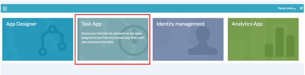
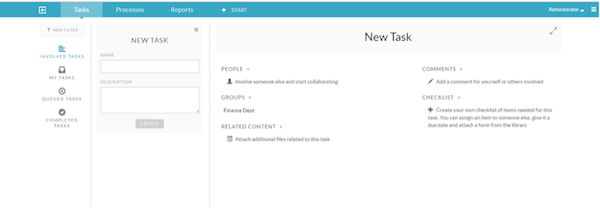
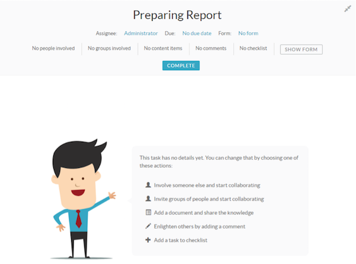
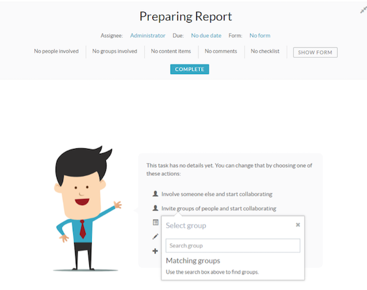
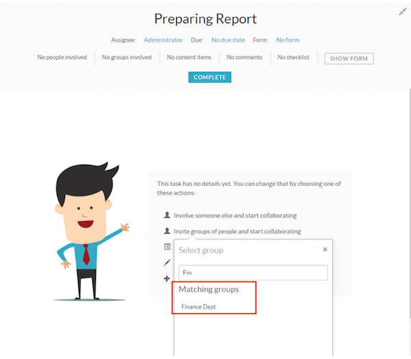
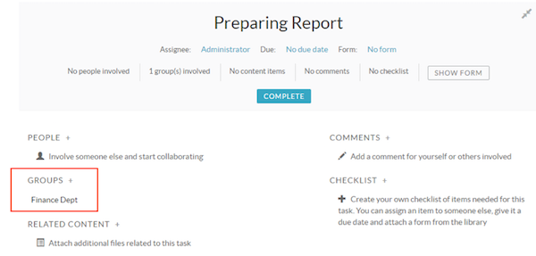
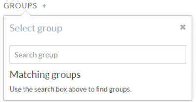

# Using Involved Tasks

As well as allowing individual collaboration on a task, you can also involve groups. You can use this feature as an alternative to manually selecting multiple individuals when involving them with a task.

Use these instructions to extend task involvement to include groups of users.

1.  Click **Task App**.

    

    The Tasks App screen is displayed and the involved **Tasks** option is highlighted.

    

2.  Create a new Involved Task.

    1.  Enter the task name in the **NAME** field.

    2.  Click **CREATE**.

    The new Involved Task is displayed.

    

3.  Click **Invite groups of people and start collaborating**.

4.  Specify the name of the group you want to collaborate with on the task.

    

    If the group exists, the matching group name is displayed on the screen.

    

5.  Select the matching group.

    

6.  Click **Groups +** to add more groups.

    

7.  Click **Complete** to complete the group involved task.

**Parent topic:**[Creating a process model](../topics/creating_a_process_model.md)

