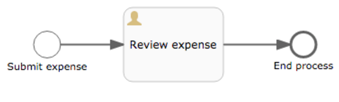

# Create your first process

This is the first of 3 simple steps in creating a process app.

In this step, you are going to design a simple expense approval process that includes 3 BPMN elements:

-   A **start event** to trigger the process by submitting a new expense
-   A **user task** to approve or reject the request
-   An **end event** to end the process

This process also includes 2 web forms.

1.  Open Alfresco Process Services from one of the following options:

    -   **Local installation**

        - address - http://localhost:8080/activiti-app/\#/

        - sign in - admin@app.activiti.com/

        - password - admin

    -   **Cloud trial** - [https://activiti.alfresco.com/activiti-app/\#/](https://activiti.alfresco.com/activiti-app/#/) \(use your online trial sign in details\)
    

2.  Select **App Designer** on your dashboard.

3.  Select **Create Process**.

4.  Give the process model a name \(for example “Expense approval”\) and a description, then select the **BPMN Editor** as the Editor type.

5.  Select **Create new model**.

    **Note:** If this is the first time you’ve used Alfresco Process Services then some help tips may be displayed. You can click **Next** to watch them or press Esc. to close them.

6.  The start event is displayed on the canvas as a circle. Double-click on it and type a name, for example “Submit expense”, then click on the canvas.

7.  Click the circle again and drag and drop the  User task icon to the right.

    

    This adds a user task after the start event.

8.  Double-click on the user task and type a name, for example “Review”, then click on the canvas.

    

9.  Click the user task again and drag and drop the  end event icon \(circle\) to the right.

10. Double-click on the end event and type a name, for example “End process”, then click on the canvas.

    

    The process model now has three stages.

11. Click  **Validate the model** on the toolbar.

    This checks models \(processes, web forms, decision tables, data models, and stencils\) for errors. If there are errors then a message shows you details on how to resolve them.

    Once it’s validated, you can add forms to the process using the Forms editor. This example needs two forms to be added:

    -   One for the requestor to submit the expense \(start event\)
    -   One for the manager to review the expense request \(user task\).
    You can create forms:

    -   Directly from the Process editor \(embedded in the BPMN model\)
    -   Separately from the process model and then reference them in the design by adding a key
    In this example they’ll be created directly from the Process editor.

12. Click the start event and then click **Referenced form** in the properties panel.

    

13. Click **New form** in the Form reference window.

14. Give the form a name \(for example “Submit expense”\) and a description, the click **Create form**.

    This opens the Form editor.

15. Drag stencils onto the Design canvas in this order:

    -   Text
    -   Amount
    -   Date
    -   Attach File
16. Hover over the **Text** stencil and click the  Edit icon, then type "Text" as the Label and click **Close**.

    Repeat this step for the other stencils you added, and type the following labels:

    -   Amount
    -   Date
    -   Attachment
    

17. Click  Save then **Save and close editor**.

18. In the Process editor click the review expense user task and then click **Referenced form** in the properties panel.

19. Give the form a name \(for example “Expense review”\) and a description, the click **Create form**.

20. Drag stencils onto the Design canvas in this order:

    -   Text
    -   Amount
    -   Date
    -   Attach File
21. Hover over the Text stencil and click the Edit icon, then type "Text" as the Label and click **Close**.

    Repeat this step for the other stencils you added, and type the following labels:

    -   Amount
    -   Date
    -   Attachment
    

22. Click the **Outcomes** tab to add a custom outcome so that the reviewer can approve or reject the expense.

23. Select **Use custom outcomes for this form**and in the **Possible** outcomes add two outcomes:

    -   Approve
    -   Reject
    

24. Click  Save then **Save and close editor.**

25. In the Process editor click  Save then **Save**.

**Next step:** [Create and publish your first process app](gs-create-publish.md)

**Parent topic:**[Getting Started with Alfresco Process Services](../topics/getting-started.md)

