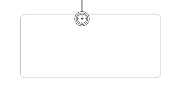

# Boundary timer event

A boundary timer event puts a timer on the activity it is defined on. When the timer fires, the sequence flow going out the boundary event is followed.

A boundary timer event is visualized as a circle with a clock icon inside:

|Property|Description|
|--------|-----------|
|Id

|A unique identifier for this element.

|
|Name

|A name for this element.

|
|Documentation

|A description of this element.

|
|Cancel activity

|Defines if the boundary event interrupts the activity is defined upon or not.

|
|Time Cycle

|A timer cycle defined in [http://en.wikipedia.org/wiki/ISO\_8601](http://en.wikipedia.org/wiki/ISO_8601) format, for example: `R3/PT10H`.

|
|Time Date in ISO-8601

|A point in time defined as a [http://en.wikipedia.org/wiki/ISO\_8601](http://en.wikipedia.org/wiki/ISO_8601) date, for example: `2015-04-12T20:20:32Z`.

|
|Time Duration

|A period of time defined as a [http://en.wikipedia.org/wiki/ISO\_8601](http://en.wikipedia.org/wiki/ISO_8601) duration, for example: `PT5M`.

|

**Parent topic:**[Boundary events](../topics/boundary_events.md)

