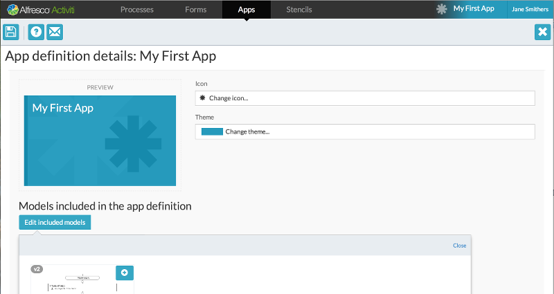

# Creating a process app

Now that we have a process defined, let’s create a process app using the **Apps** page.

1.  On the **Apps** page, click **Create app definition**.
2.  Select an icon and theme for the tile. You can have an app without any process definitions linked to it, which lets you create a simple custom task list.
3.  Click **Edit included models** to use the process we’ve just defined, and select from the lists to add a model.

    

4.  Save the app and select the option to publish the app in the **Save** dialog to return the Apps list view.

    You can do similar actions on an app in its **Details** page for all models, such as deleting and sharing. You can also publish the app directly instead of doing it via the Save dialog. Publishing an app makes it available to everyone you’ve shared it with to add to their landing page. Let’s add it to our landing page so we can see our process in action.

5.  On your landing page, click the tile with the + \(plus\) icon. The Add app to landing page dialog appears.
6.  Choose the apps you want to add and click **Deploy**. A new tile will be added to your landing page.

**Parent topic:**[Creating a process model](../topics/creating_a_process_model.md)

