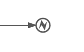

# Error end event

You use the end error event to throw an error and end the current path of execution.

The error can be caught by an intermediate boundary error event that matches the error. If no matching boundary error event is found, an exception will be thrown

|Property|Description|
|--------|-----------|
|Id

|A unique identifier for this element.

|
|Name

|A name for this element.

|
|Documentation

|A description of this element.

|
|Execution listeners

|Execution listeners configured for this instance.

|
|Error reference

|The error identifier. This is used to find a matching catching boundary error event. If the name does not match any defined error, then the error is used as the error code in the thrown exception.

|

**Parent topic:**[End events](../topics/end_events.md)

