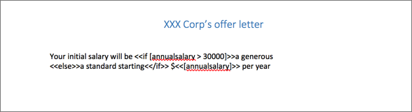

# Generate document

Use this step to generate a Microsoft Word or PDF document from a template in Microsoft Word. The process step will substitute any variables you place in the template document with process and form variables. You can upload global template documents for use by all users, or upload personal template documents for your own use.

**Note:** A user with administration privileges can upload global templates. An administrator can add templates on the Tenant page of the [Identity Management](identity_management.md) app.

The Generate Document step dialog contains the following tabs to define the task:

-   **Details tab**
    -   **Name and Description** - Type the name and description of your task.

    -   **Output name** - Type the name of your output document.

    -   **Output format** - Click the format that you want to view your generated document: PDF or Word.

-   **Template tab**

    Select from a list of company templates that an administrator has uploaded or upload your own personal templates by clicking **Upload Template**. In the above example, the `offer.docx` company template is selected.

    You can also filter the list of company templates with a search string, and download any template to see what form and process variable substitutions are made in the template.

-   **Variable tab**

    Enter a variable name that you have used in the document.

    In the template, you can substitute `<<[name]>>` in the output document with the form variable name, for example:




Templates are processed using the [LINQ reporting engine](http://www.aspose.com/docs/display/wordsjava/LINQ+Reporting+Engine+Programmers+Guide). Refer to the programming guide in the link for the [format](http://www.aspose.com/docs/display/wordsjava/Template+Syntax) of the templates, and [examples](http://www.aspose.com/docs/display/wordsjava/Appendix+C.+Typical+Templates) to help you create your own templates.

You can also use expressions to build more complex templates. For example, the following excerpt was used in an HR offer letter of XXX Corp called *offer-letter.docx*:

```
    Your initial salary will be <<if [annualsalary > 30000]>>a generous
<<else>>a standard starting<</if>> $<<[annualsalary]>> per year
```

The sample template referred above uses conditional expressions that tests the value of the form variable `annualsalary` and outputs one of the two different text phrases, depending on that value.

To test the *offer.docx* template, create a process definition that uses the template. For example:

1.  Create a process with the option started by user filling in a form.
2.  Create a form called starter with four fields: a text field with the ID name, a set of radio buttons with the ID department, and two number fields with the IDs annualsalary and annualbonus.
3.  Once you have filled the form, the Generate Document step will take the `offer.docx` template \(mentioned above\) and generate a document with a name defined by value of the Variable tab, `offer-letter.docx`.
4.  Create an app to include the process definition that you just defined, and then publish the app.
5.  Click **Start Process**. The Generate Document step is executed and the `offer-letter.docx` document is generated.

In this example, the Generate Document step is the last step in the process definition, therefore you can view and download the generated document of the completed process in the Alfresco Process Services process view.

**Parent topic:**[Step editor](../topics/step_editor.md)

