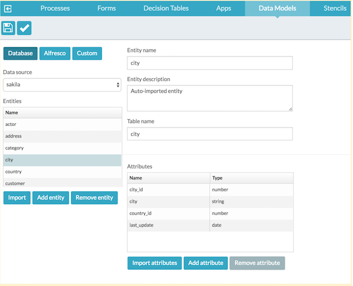
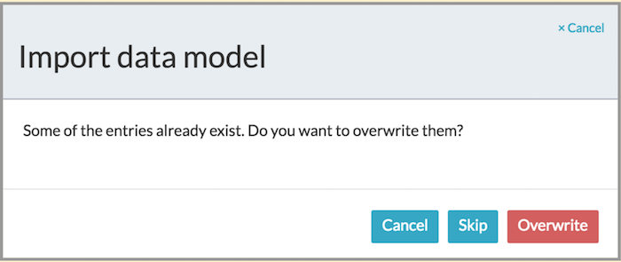
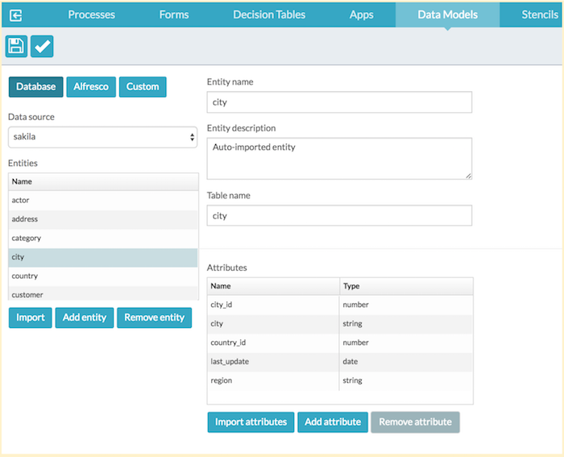

# Importing data models

Use these instructions to import a data model from a database schema.

**To define a data model:**

1.  From the **App Designer**, click **Data Models**.

    The **Data Models** page is displayed.

2.  Click **Create Data Model**.

    The Create a new data model dialog box appears. Or to import an existing data model, click **Import Data Model**.

3.  Select the data source that you defined in Identity Management.
4.  Click **Import**.

    This examines the RDBMS of the datasource and creates an entity and an attribute for each table. In this example, we use the MySQL sample database, Sakila. For more information, see [https://dev.mysql.com/doc/sakila/en/sakila-installation.html](https://dev.mysql.com/doc/sakila/en/sakila-installation.html).

    

5.  You can now change the attributes, save the model, and use it as if it was created manually.
6.  If you attempt to re-import a database schema, you can either:
    -   cancel the operation,
    -   skip overwriting the existing entities and only import entities added since the last import, or
    -   overwrite all entities.

        

        If you overwrite, any changes made to the entities and the attributes since your last import will be lost.

7.  You may also use **Import attributes** for individual entities which updates the attributes of the selected entity. This is useful if you have only made changes to a single table. In our example, the field region was added in the city table.

    

    To import attributes:

    1.  Select the entity you want to update.
    2.  Click **Import attributes**.
    3.  You will prompted again to select how to handle the existing attributes.

        You can either:

        -   cancel the operation,
        -   skip overwriting the existing entities and only import entities added since the last import, or
        -   overwrite all entities.
        Select **Skip** overwriting existing attributes if you have renamed attributes and you want to save your changes while adding new attributes.

        Select **Overwrite** if you want to reset the changes you have made to the attributes and bring in new additions.

**Parent topic:**[Data Models](../topics/data_models.md)

