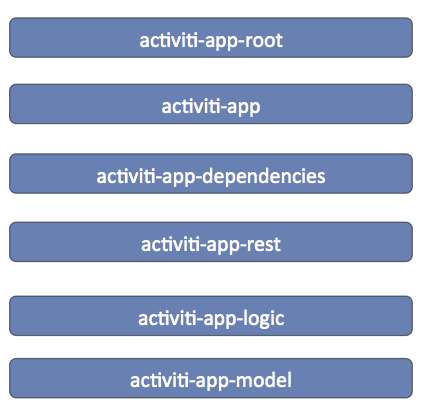

# Maven modules

When customizing, overriding, or creating new logic in Alfresco Process Services, it is useful to be able to develop against the relevant Maven modules.

The following Maven modules are the most import one.

The diagram is structured in such a way that the lowest module is a dependency of the module one up higher \(and so forth\).

All Maven modules have **com.activiti** as Maven *groupId*. The version of the artifact is the release version of Process Services.

-   **activiti-app-model** : Contains the *domain objects*, annotated with JPA annotations for persistency and various Spring repositories for executing the actual database operations. Also has the Java pojos of the JSON representations that are used for example as responses by the REST endpoints.

-   **activiti-app-logic** : Contains the services and actual BPM Suite logic.

-   **activiti-app-rest** : Contains the REST endpoints that are used by the UI and the public API.

-   **activiti-app-dependencies** : Contains all the Alfresco Process Services dependencies. It is also a convenient Maven module \(packaging type is *pom*\) for development.

-   **activiti-app** : Contains configuration classes.

-   **activiti-app-root**: Contains the root pom. **Do not use this for development.**

**Parent topic:**[Developer guide](../topics/developmentGuide.md)

