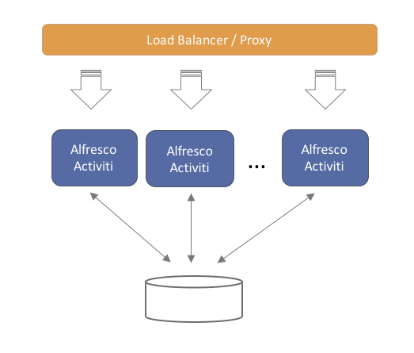

# Multi-node clustered setup

Running the application on multiple servers, for performance, resilience or failover reasons, is straightforward. The application is architected to be stateless. This means that any server can handle any request from any user. When using multiple servers, it is enough to have a traditional load balancer \(or proxy\) in front of the servers running the Alfresco Process Services application. Scaling out is done in a "horizontal" way, by simply adding more servers behind the load balancer.

Note that each of the servers will connect to the same relational database. While scaling out by adding more servers, don’t forget to also make sure the database can handle the additional load.

**Parent topic:**[Administering Alfresco Process Services](../topics/adminGuide.md)

