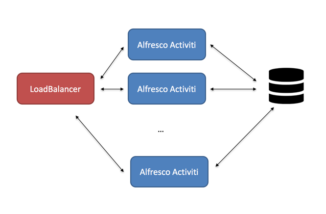
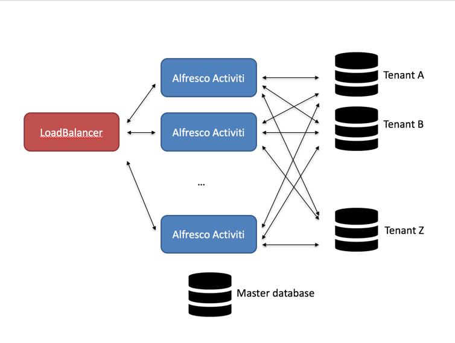
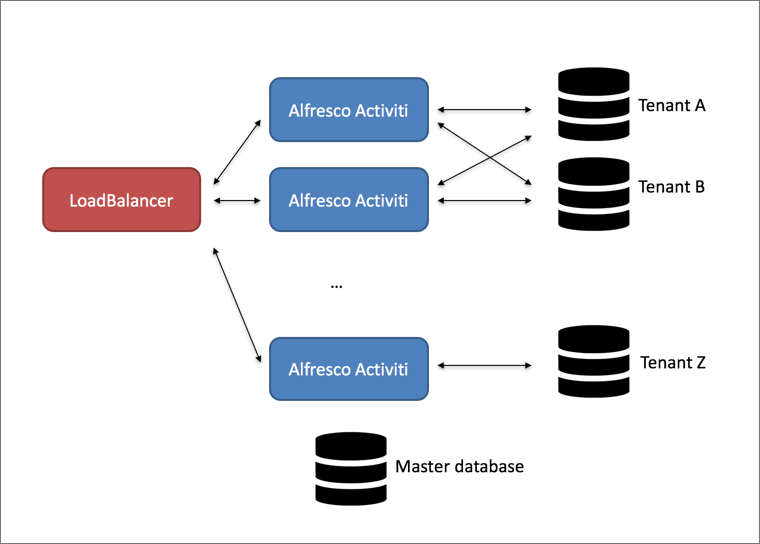

# Multi-schema multi-tenancy \(MS-MT\)

It is possible to run Alfresco Process Services in so-called "multi-schema multi-tenancy" mode \(MS-MT\). This is a multi-tenant setup, where every tenant has its own database schema. This means that the data of one tenant is completely separated from the data of other tenants.

This is an alternative to the "regular" multi-tenant mode, where the data of all tenants is stored in the same database schema and the data gets a "tenant tag" to identity which tenant the data belongs to. The following diagram shows this setup:

The main benefit of this setup is the ease of setup and configuration: there is no difference with setting up a single-tenant or multi-tenant. Each request can be handled by any node and the loadbalancer simply can route using simple routing algorithms.

The downside of this setup is clearly that the database can become the bottleneck if it has to hold all the data of all tenants and there is no "physical separation" of the tenant data.

The MS-MT setup looks as follows:

The most important benefit of this approach is that the data of each tenant is completely separated from the data of other tenants. Since only data of one tenant is stored in the database schema, queries will generally be more performant.

The downside of this approach is immediately visible in this diagram: each node needs to have a connection pool to the database schema of the tenant. With many tenants, this can mean quite a bit of "housekeeping" that will need to be performed compared to the previous approach \(which can be negative for performance\). Note that there is a "master database" or "primary database" in this diagram. This database stores the configurations of the tenant data sources and the mapping between user and tenant.

Alternatively, as shown in the following diagram, it is possible to configure the Suite nodes as such that they only manage a certain list of tenants \(for example in the picture below the last node only manages tenant Z, and the first two manage tenant A and B, but not Z\). Although this alleviates the downside of the previous setup, it does come with an extra cost: the load balancer now needs to be more intelligent and needs to route the incoming request to the appropriate node. This means that the request needs information to differentiate as to which tenant the request is coming from. This needs custom coding on the client side and is not by default available in the Alfresco Process Services web client.

Taking this to the extreme, it is possible to have one \(or more nodes\) for one tenant. However, in that case it is probably easier to run a single tenant Alfresco Process Services for each tenant. The remarks about the load balancer and enriching the request with tenant information as in the previous setup still apply.

-   **[MS-MT known limitations](../topics/known_limitations.md)**  
 Currently, following known limitations apply to the multi-schema multi-tenancy \(MS-MT\) feature:
-   **[MS-MT Technical implementation](../topics/technical_implementation.md)**  
This section describes how the MS-MT feature works and can be skipped if only interested in setting up an MS-MT Alfresco Process Services.
-   **[Getting started with MS-MT](../topics/getting_started.md)**  
To run Alfresco Process Services, you need to have installed a *multi-tenant* license. Switching to MS-MT mode is done setting the *tenancy.model* property to *isolated*.
-   **[Behavior in a multi-node setup](../topics/behavior_in_a_multi_node_setup.md)**  
Assuming a multi-node setup: when creating new tenants, the REST call is executed on one particular node. After the tenant is successfully created, users can log in and use the application without any problem on any node \(so the loadbalancer can simply randomly distribute for example\). However, some functionality that depends on backgrounds threads \(the job executor, for example\) will only start after a certain period of time since the creation of the tenant on another node.
-   **[MS-MT configuration properties](../topics/configuration_properties.md)**  
 There are some configuration properties specific to MS-MT:
-   **[Pluggability](../topics/pluggability.md)**  
 Following interfaces can be used to replace the default implementations of MS-MT related functionality:

**Parent topic:**[Configuring Alfresco Process Services](../topics/administration_application_config.md)

