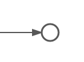

# None end event

A none end event ends the current path of execution.

|Property|Description|
|--------|-----------|
|Id

|A unique identifier for this element.

|
|Name

|A name for this element.

|
|Documentation

|A description of this element.

|
|Execution listeners

|Execution listeners configured for this event.

|

**Parent topic:**[End events](../topics/end_events.md)

