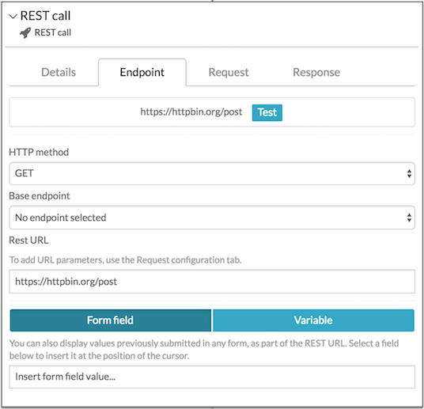
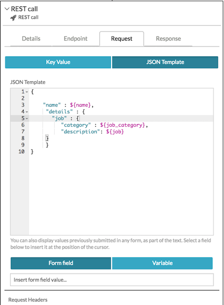

# REST call

This step allows you make an arbitrary REST call. You can define a full endpoint directly or use an endpoint defined by an administrator on your Alfresco Process Services server. You can supply parameters to the call directly in the URL or from process variables in forms, and you can extract properties from the JSON response into process variables for use in your process definition.

**Note:** A user with administration privileges will need to add endpoints for standard REST calls, with Username and Password pairs that are permitted for basic authentication. An administrator can add these endpoints and authentications on the Tenant page of the [Identity Management](identity_management.md) app. The benefit of using standard endpoints is that they can be easily switched for test and deployment configurations. It is also possible to use a REST step to call the Alfresco Process Services REST API.

The REST call step dialog contains four tabs that let you fully define the call.

Name and Description are simple text fields that help you and others to identify the task in your task list.

You define the URL for your REST call in this tab.

-   **HTTP Method**

    This is the method associated with the REST call. The default is GET, but you must select between GET, POST, PUT, and DELETE based on the documentation for your chosen API call. The example shown in the screenshot, is using the `api/enterprise/app-version` REST call, which is documented as a GET call.

-   **Base endpoint**

    You select one from a list of endpoints that have been defined by your administrator. In the example the endpoint for the local Alfresco Process Services server REST API, [http://localhost:8080/activiti-app/](http://localhost:8080/activiti-app/), has been chosen.

-   **Rest URL**

    Copy the URL fragment from your selected REST API call. In this example we are using `api/enterprise/app-version`.

    You may also choose to enter the full URL, especially for REST services that have not been defined by your administrator, for example, [http://httpbin.org/post](http://httpbin.org/post). This can be useful during development and prototyping cycles.

    In all cases, you can use the **Test** button to test your endpoint.

    

-   **Form Field/Variables**

    You can insert values previously submitted in any form \(or variables\) in your process definition, into the REST URL. The value will be inserted at the position of the cursor in the Rest url field.

Some REST calls require a JSON request body. You can add one or more JSON properties using this tab.

For each property you define the name, property type and value. The value can either be a fixed value, or you can select the value of a form field from a list of available form fields in your process definition.

REST calls return a JSON response body. You can define one or more pairs JSON response properties and process variables. When the step completes, each process variable will contain the value of the returned response property. You can use those values later in your process. In this example, the returned JSON property edition will be contained in the process variable *activitiedition*, which is a form field in a form used for displaying the edition string later in the process definition.

For complex and nested POST request bodies, specify a JSON Template which is evaluated at run-time. The JSON editor provides syntax highlighting and will highlight any JSON syntax errors on the line number indicator.

**Parent topic:**[Step editor](../topics/step_editor.md)

