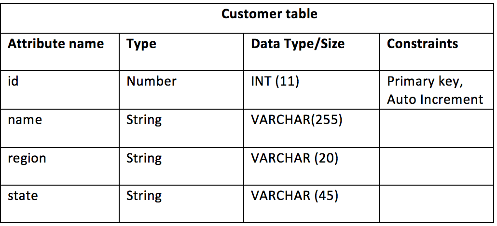

# Saving data using your data model

As you collect new data about an entity, you may wish to save this back to the database. However, as this is not done automatically when a form is saved, you must create a task in your process to explicitly save the data you want.

**To save data using the data model:**

1.  From the **App Designer**, edit the business process model you created above to access data.
2.  In the **Visual Editor**, drag the **Store entity task** activity type from the palette and place before the process **End**.
3.  Remove the link from the selected task and connect the Store task between it and the process End.
4.  Edit the Store entity task activity and click the attribute mapping field. Configure the following settings in the Attribute Mapping dialog box:
    -   **Mapped data model** – Select the data model to map your entity with.

    -   **Mapped entity** – Select the entity to map your data model with.

    -   **New Variable/ existing variable** – Create a new variable or select an existing variable.

    -   **Attribute name** – Map the attribute names with the relevant form fields by selecting the relevant form field value from the drop-down list. For example, Customer Id with ID and Customer name with Name.

    -   **Mapped value type** – Select one of the value types for mapping attributes. In the above example, Form field was selected. However, you can also map your attributes with a static field or variable.

5.  Create a new app definition and associate your process with it.
6.  Deploy the app and test it by updating the data. For example:
    -   Open your app and click **+ START**. The form fields that you defined in your process appear.

    -   Edit an existing Id \(column name\) with a new customer name and verify if the changes appear in your database.

**Sample database table**

While working on the data model functionality, locate or create a database table and its columns from your database and make sure to create matching attributes in your Data Model. For example, the following customer table was used for the customer data model in the above sections.

**Parent topic:**[Data Models](../topics/data_models.md)

