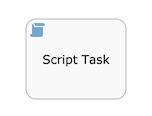

# Script task

A script task defines a JavaScript script or other script language \(JSR-223 compatible language\) that is executed when a process instance executes this step.

A script task is visualized as a rounded rectangle with a paper icon inside.

|Property|Description|
|--------|-----------|
|Script format

|The [JSR-223](http://jcp.org/en/jsr/detail?id=223) name of the scripting engine your script is written for. By default, Alfresco Process Services supports *javascript* and *groovy* formats.

|
|Script

|The actual script that will be executed.

|
|Id

|A unique identifier for this element.

|
|Name

|A name for this element.

|
|Documentation

|A description of this element.

|
|Variables

|In the script, it is possible to set new process variables \(using *'execution.setVariable\(*myVariable*, *myValue*\)**\), however these won’t show up automatically in dropdowns later on \(like the sequence flow condition builder, forms, etc.\). To make them show up, configure this property with the variables that are set or 'exported* by this script task.

|
|Execution listeners

|Execution listeners configured for this instance. An execution listeners is a piece of logic that is not shown in the diagram and can be used for technical purposes.

|
|Asynchronous

|\(Advanced\) Define this task as asynchronous. This means the task will not be executed as part of the current action of the user, but later. This can be useful if it’s not important to have the task immediately ready.

|
|Exclusive

|\(Advanced\) Define this task as exclusive. This means that, when there are multiple asynchronous elements of the same process instance, none will be executed at the same time. This is useful to solve race conditions.

|
|Multi-Instance type

|Determines if this task is performed multiple times and how. For more information on multi-instance, The possible values are:

 -   ****None****

The task is performed once only.

-   ****Parallel****

The task is performed multiple times, with each instance potentially occurring at the same time as the others.

-   ****Sequential****

The task is performed multiple times, one instance following on from the previous one.

|
|Cardinality \(Multi-instance\)

|The number of times the task is to be performed.

|
|Collection \(Multi-instance\)

|The name of a process variable which is a collection. For each item in the collection, an instance of this task will be created.

|
|Element variable \(Multi-instance\)

|A process variable name which will contain the current value of the collection in each task instance.

|
|Completion condition \(Multi-instance\)

|A multi-instance activity normally ends when all instances end. You can specify an expression here to be evaluated each time an instance ends. If the expression evaluates to true, all remaining instances are destroyed and the multi-instance activity ends.

|
|Is for compensation

|If this activity is used for compensating the effects of another activity, you can declare it to be a compensation handler. For more information on compensation handlers see the Developer Guide.

|

**Parent topic:**[Activities](../topics/activities.md)

