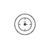

# Start timer event

A timer start event initiates a process instance at specific time. You can use it both for processes which must start only once and for processes that must start in repeated time intervals.

It is visualized as a circle with a clock icon.

Note that a process instance started by a timer start event can’t have a start form, as it is started by the system. Similarly, it does not have a process initiator like a *none start event*. As such when assigning tasks later on in the process definition, keep in mind that the assignment *'assigned to process initiator'* will not work.

**Note:**

A subprocess can’t have a timer start event.

|Property|Description|
|--------|-----------|
|Id

|A unique identifier for this instance.

|
|Name

|A name for this element.

|
|Documentation

|A description of this element.

|
|Execution listeners

|Execution listeners configured for this instance. An execution listeners is a piece of logic that is not shown in the diagram and can be used for technical purposes.

|
|Time Cycle

|A timer cycle defined in [http://en.wikipedia.org/wiki/ISO\_8601](http://en.wikipedia.org/wiki/ISO_8601) format, for example: `R3/PT10H`.

|
|Time Date in ISO-8601

|A point in time defined as a [http://en.wikipedia.org/wiki/ISO\_8601](http://en.wikipedia.org/wiki/ISO_8601) date, for example: `2015-04-12T20:20:32Z`.

|
|Time Duration

|A period of time defined as a [http://en.wikipedia.org/wiki/ISO\_8601](http://en.wikipedia.org/wiki/ISO_8601) duration, for example: `PT5M`.

|

**Parent topic:**[Start events](../topics/start_events.md)

