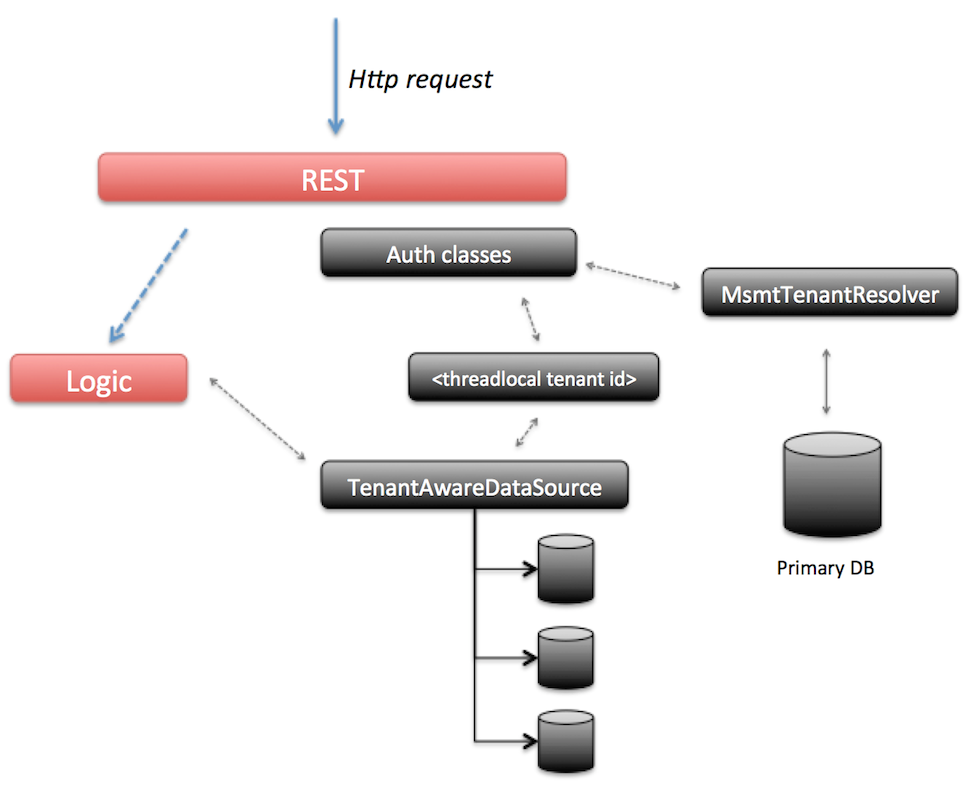

# MS-MT Technical implementation

This section describes how the MS-MT feature works and can be skipped if only interested in setting up an MS-MT Alfresco Process Services.

The MS-MT feature depends on this fundamental architecture:

-   There is one **"primary datasource"**

    -   The configurations of the tenants is stored here \(for example their data source configuration\).

    -   The user to tenant mapping is stored here \(although this can be replaced by custom logic\).

    -   The "Tenant Manager" user is stored here \(as this user doesn’t belong to any tenant\).

-   There are **x data sources**

    -   The tenant specific data is stored here.

    -   For each tenant, a datasource configuration similar to a single tenant datasource configuration needs to be provided.

    -   For each tenant datasource, a connection pool is created.

-   When a request comes in, the tenant is determined.

    -   A **tenant identifier** is set to a threadlocal \(making it available for all subsequent logic executed next by that thread\).

    -   The *com.activiti.database.TenantAwareDataSource* switched to the correct tenant datasource based on this threadlocal.

The following diagram visualizes the above points: when a request comes in, the security classes for authentication \(configured using Spring Security\) will kick in before executing any logic. The request contains the *userId*. Using this *userId*, the *primary datasource* is consulted to find the *tenantId* that corresponds with it \(note: this information is cached in a configurable way so the primary datasource is not hit on every request. But it does mean that user removals from a tenant can take a configurable amount of time to be visible on all nodes\). This does mean that in MS-MT mode, there is a \(very small\) overhead on each request which isn’t there in the default mode.

The *tenantId* is now set on a threadlocal variable \(mimicking how Spring Security and its SecurityContext works\). If the value is ever needed, it can be retrieved through the *com.activiti.security.SecurityUtils.getCurrentTenantId\(\)* method.

When the logic is now executed, it will typically start a new database transaction. In MS-MT mode, the default DataSource implementation is replaced by the *com.activiti.database.TenantAwareDataSource* class. This implementation returns the datasource corresponding with the *tenantId* value set on the threadlocal. The logic itself remains unchanged.

The MS-MT feature does have a technical impact on some other areas too:

-   All default caches \(process, forms, apps, script files, …\) cache based on the db id as key. In MS-MT mode, the db id is not unique over tenants and the cache switches to a *cache per tenant* implementation.

-   Event processing \(for analytics\) by default polls the database for new events which needs to be sent to Elastic Search. In MS-MT mode, the events for each tenant datasource are polled.

-   The Process Engine job executor \(responsible for timers and async continuations\) polls the database for new jobs to execute. In MS-MT mode, this polling needs to happen for each tenant datasource.

-   The Hibernate id generator keeps by default a pool of identifiers for each entity primary key in memory. Hibernate keeps the *lastest id* stored in a database table. In MS-MT mode however, there should be a pool for each tenant and the id generator needs to use the correct tenant datasource for refreshing the pool of ids.

-   A similar story applies for the Process Engine id generator.

**Parent topic:**[Multi-schema multi-tenancy \(MS-MT\)](../topics/multi_schema_multi_tenancy_ms_mt.md)

