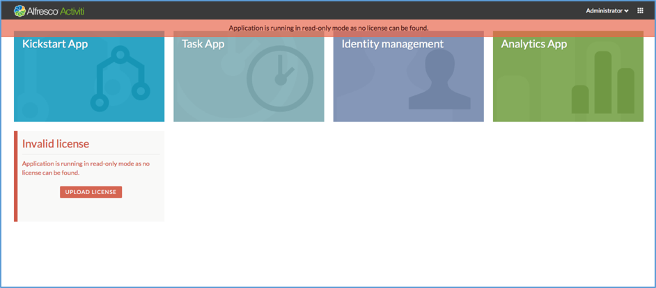
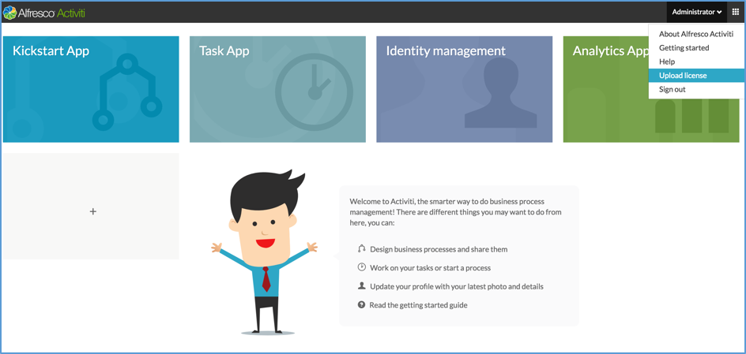

# Uploading a license from the User Interface

To use the license upload feature, add that capability to the appropriate user. Typically an administrator has the capability to add licenses from the **Identity management** app \> **Capabilities** tab.

You can upload the license file from the user interface using one of the two methods:

-   **Option 1: Landing page**

-   **Option 2: User menu**

**To upload the license file from the landing page:**

1.  Start Alfresco Process Services.
2.  From the **Landing page** \> **Invalid license** tile, click **Upload License**. A dialog box appears to locate the license file from your computer.
3.  Select the file and click **Upload**. The new license will be applied to your repository.

**To upload the license file from the User menu:**

1.  Start Alfresco Process Services.
2.  Expand the User menu and click **Upload license**. A dialog box appears to locate the license file from your computer.
3.  Select the file and click **Upload**. The new license will be applied to your repository.

**Parent topic:**[Administering Alfresco Process Services](../topics/adminGuide.md)

