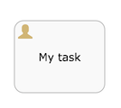

# User task

A user task enables you to model work to be done by a human actor. When process execution arrives at a user task in the process definition, it creates a new task in the task list of the assignee or assignees defined in the task.

A user task is depicted as a rounded rectangle with a user icon on the top-left corner.

|Property|Description|
|--------|-----------|
|Id

|A unique identifier for this element

|
|Name

|A name for this element.

|
|Documentation

|A description of this element.

|
|Assignment

|Configures to who this task should be assigned. It is possible to use *Fixed Values* \(advanced usage: these are Alfresco Process Services expressions, for example by invoking a class or Spring bean\) or use the *Identity Store* option. It is recommended to use *Identity Store* to select groups and users in the system:

 -   ****Assigned to process initiator****

The user that started the process instance will be the assignee of this task.

-   ****Assigned to process initiator’s \(primary\) group manager****

The group manager of the user that started the process instance will be the assignee of this task.

-   ****Assigned to single user****

A single user who will be the assignee of the task. This user will see the task in their *Involved tasks* task list. It is possible to reference a user that was selected in a previous form field \(tab *Form field*\).

-   ****Assigned to group manager****

The group manager of the user will be the assignee of the task. Only users that have a primary group defined will have a group manager. To define a primary group, go to **Identity Management** \> **Users** \> **Select an action** \> **Change primary group**.

-   ****Candidate users****

One or more users as the *candidate\(s\)* of the group. The task will show up in their *Queued tasks* task list. The task is not yet assigned to them. They first have to *claim* the task, which will make that one user the assignee. The other users won’t see that task in a task list anymore. It is possible to reference users that were selected in a previous form field \(tab *Form field*\).

-   ****Candidate groups****

One or more groups whose members will be the *candidate* of the group. The task will show up in their *Queued tasks* task list. The task is not yet assigned to them. They first have to *claim* the task, which will make that one user the assignee. The other users won’t see that task in a task list anymore. It is possible to reference groups that were selected in a previous form field \(tab *Form field*\).

-   ****Allow process initiator to complete task****

When checked, the user that started the process instance \(process initiator\) can complete the task. This is checked by default.

|
|Referenced form

|Allows to configure or create the form for this task. This form \(also called \_task form\) will be rendered when the task is shown in the task list of the user. A user task typically always has a form defined.

|
|Form key

|This is a property that exists for compatibility with the community version. When working with task lists and forms, do not set this property.

|
|Form properties

|This is a property that exists for compatibility with Alfresco Process Services community. When using Alfresco Process Services to work with task lists and forms, do not set this property.

|
|Due date

|Allows to configure a due date for the task. In the task list, tasks can be sorted by due date to see which tasks are needed to be completed the soonest. The possible ways of configuring are:

 -   ****No due date****

This is the default value.

-   ****Expression definition \(Advanced\)****

Uses an Alfresco Process Services expression to resolve the due date \(for example, this expression could call a Spring bean\).

-   ****Fixed duration after task creation****

Allows to configure an amount of time, starting from the creation of the task.

-   ****Based on field****

Allows to configure the due date based on a previous field in the process instance, by adding or subtracting a certain amount of time.

-   ****Based on variable****

Allows to configure the due date based on a variable previously declared in the process instance, by adding or subtracting a certain amount of time.

|
|Allow email notifications

|When enabled, an email will be sent to the assignee when the task is created.

|
|Asynchronous

|\(Advanced\) Define this task as asynchronous. This means the task will not be created as part of the current action of the user, but later. This can be useful if it’s not important to have the task immediately ready.

|
|Exclusive

|\(Advanced\) Define this task as exclusive. This means that, when there are multiple asynchronous elements of the same process instance, none will be executed at the same time. This is useful to solve race conditions.

|
|Execution listeners

|Execution listeners configured for this instance. An execution listener lets you execute Java code or evaluate an expression when an event occurs during process execution.

|
|Multi-Instance type

|Determines if this task is performed multiple times and how. The possible values are:

 -   ****None****

The task is performed once only.

-   ****Parallel****

The task is performed multiple times, with each instance potentially occurring at the same time as the others.

-   ****Sequential****

The task is performed multiple times, one instance following on from the previous one.

|
|Cardinality \(Multi-instance\)

|The number of times the task is to be performed.

|
|Collection \(Multi-instance\)

|\(Used with Multi-Instance type\) The name of a process variable which is a collection. For each item in the collection, an instance of this task will be created.

|
|Element variable \(Multi-instance\)

|A process variable name which will contain the current value of the collection in each task instance.

|
|Completion condition \(Multi-instance\)

|A multi-instance activity normally ends when all instances end. You can specify an expression here to be evaluated each time an instance ends. If the expression evaluates to true, all remaining instances are destroyed and the multi-instance activity ends.

|
|Is for compensation

|If this activity is used for compensating the effects of another activity, you can declare it to be a compensation handler. For more information on compensation handlers see the Developer Guide.

|

**Parent topic:**[Activities](../topics/activities.md)

