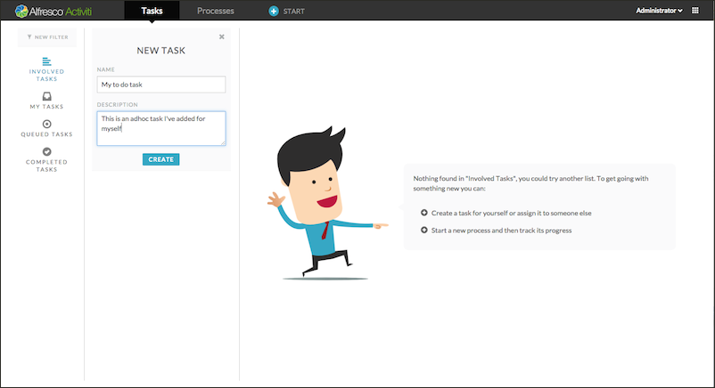
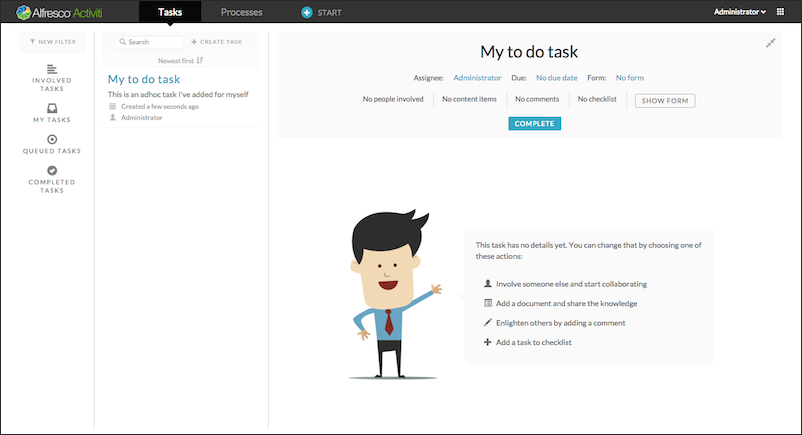
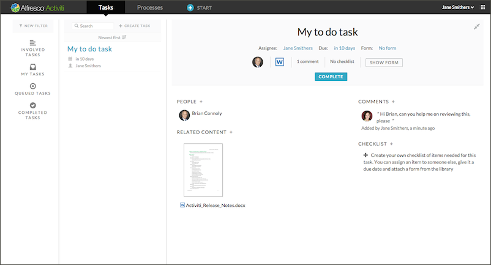
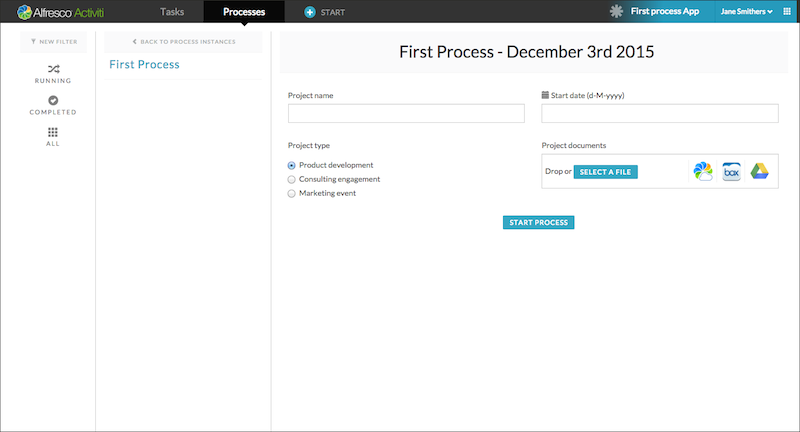
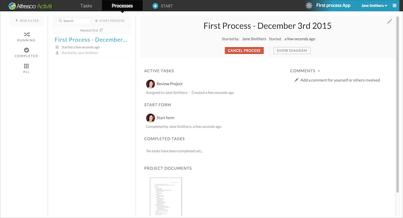
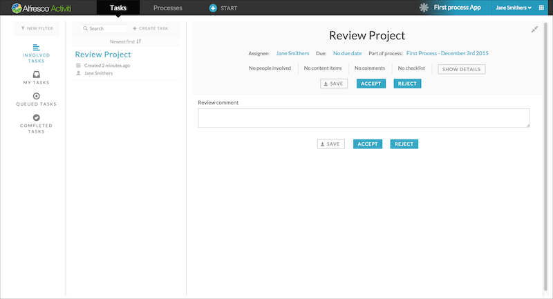
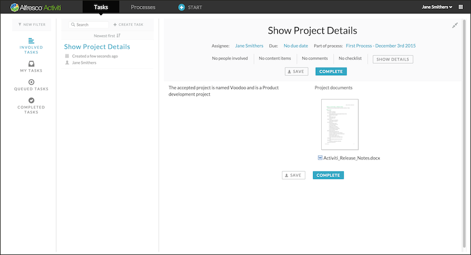

# Using My Tasks and Process Apps

A process app is a collection of processes that you want to group together to make them available to yourself or other users you share it with.

**To access tasks and processes:**

1.  Click on the new app tile that you just created and you will be taken to its **Task** page. This will only show the tasks created within this app or as part of the processes from the app.
2.  Click on the hint box to create a task and fill in some text. You will now have a task in your task list.

    

3.  Complete a task by clicking **Complete**. The task will no longer be available in your task list. Before you click Complete, you can do a variety of things with a task, such as give it a due date or assign it to someone else.

    

    When you involve someone else in a task, it will appear in their tasks list. This enables them to contribute to the task such as add comments, documents, and even involve more people. However, only the person who is assigned the task with can actually complete it. In the following example we’ve added a document, a comment, and involved a person.

    

4.  Click **Complete**. If you wish to view that task again, you can click the **Completed Tasks** filter on the left pane. By default, you will see all tasks you are involved with, however you can customize your view to:
    -   Tasks that are directly assigned to you

    -   Tasks where you are listed as a candidate

    -   Tasks that belong to the group you’re member of

        **Note:** Not all user accounts may have groups assigned.

        Now that the tasks have been created, let’s start the process we designed earlier.

5.  Click **+ Start** in the header area. A list of available processes are displayed, which in our case will be only one. When you select it, the Start form we created above is displayed. You can also change the name by clicking the title on the right panel. By default the current date is added to the name of the process.

    

6.  Fill in the form and click **Start Process**.

    You will be returned to the **Processes** page, showing the details of the newly started process in your process list.

    

    You can always view a process to see what the current and completed tasks are, as well as add comments that will be available for anyone involved in the process at any stage. If you go to the **Task** page that we just created, you will see the first step in the process is that of a task to review the project, and accept or reject it. The task was assigned to you because it was set to the process initiator, and you started the process.

    

    Before you fill in the review summary and choose accept or reject, you can still add people, documents, and comments by clicking on the **Show details** button in the task header area. You can get back to the form from there by clicking the **Show form** button. If you click the **Accept** button, the **Review Project** task will disappear and instead a new task, **Update Project List** will appear. This is because you defined it as the next choice step in the Step Editor, if the choice was to accept the project. You can just click the **Complete** button to move to the next step, which is a task to show the details of the accepted project.

    

When you complete this task, your task list and your process list will be empty. If you prefer to see all your tasks and processes in one place rather than through different process apps, you can use the **My Tasks** tile to get your complete task and process lists.

**Parent topic:**[Creating a process model](../topics/creating_a_process_model.md)

