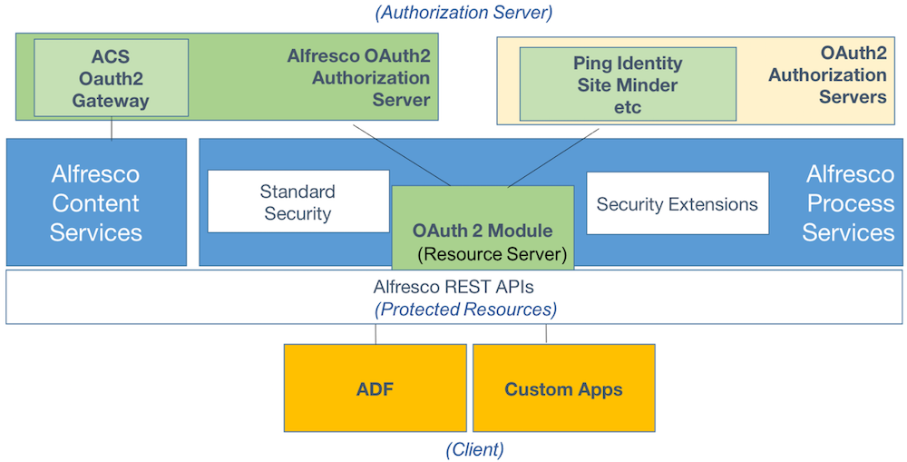

# OAuth 2 SSO overview

The OAuth 2.0 authorization framework enables an application to access protected resources on behalf of a user without storing a password.

OAuth 2.0 defines four roles:

-   **Resource owner**: Specifies the user who authorizes an application to access their account or protected resources \(REST APIs\).
-   **Resource server**: Specifies the server hosting the protected resources \(REST APIs\). In this case, it is Alfresco Process Services.
-   **Client**: Specifies your build application that makes protected resource \(REST APIs\) requests on behalf of the resource owner. Before it may do so, it must be authorized by the resource owner.
-   **Authorization server**: Specifies the server issuing access tokens to the client after successfully authenticating against Ping Identity, Azure Identity Services, or Site Minder.

OAuth 2 SSO support in Alfresco Process Services introduces a new set of components that allow developers to leverage the Alfresco REST APIs using OAuth 2 authorization.

The addition of OAuth 2 in Alfresco Process Services is the first step towards a single standards-authorization and identity services across the Alfresco Digital Business Platform. Using OAuth you can have:

-   a standard-based authorization infrastructure to integrate applications and solutions using Alfresco Process Services REST APIs with other enterprise applications which use OAuth.

-   configurable integration with OAuth authorization servers that can issue OAuth 2 tokens, such as Ping Identity, Azure Identity Services, or Site Minder, with support for custom and JWT tokens.
-   a unified OAuth 2 stack to facilitate OAuth 2 SSO for ADF and other applications across both Alfresco Process Services and Alfresco Content Services.

-   **[OAuth 2 SSO features](../concepts/OAuth-features.md)**  
Use this information to understand the features of OAuth 2 SSO for Alfresco Process Services.
-   **[Installing OAuth 2 SSO for Alfresco Process Services](../tasks/install-OAuth.md)**  
Use this information to install OAuth 2 SSO for Process Services.
-   **[Configuring OAuth 2 for the Alfresco Process Services](../concepts/config-OAuth.md)**  
To configure OAuth 2, you need to register your application with an OAuth 2 Authorization server and then configure the OAuth 2 client using the activiti-app.properties file.
-   **[Configuring the Alfresco OAuth 2 Authorization server](../concepts/config-OAuth-server.md)**  
You can configure the Alfresco OAuth 2.0 Authorization server using the application.properties file.
-   **[Running the Alfresco OAuth 2 Authorization server](../concepts/running-OAuth-server.md)**  
You can run the Alfresco OAuth 2 Authorization server as a Java executable from the command line.
-   **[Using the Alfresco OAuth 2 Authorization server](../concepts/using-OAuth-server.md)**  
The Alfresco OAuth 2 Authorization server can be used as part of the OAuth 2 flows. The server needs to be used in conjunction with the LDAP sync for users from the Alfresco Content Services LDAP directory.

**Parent topic:**[REST API Authorization](../topics/rest_api_authorization.md)

