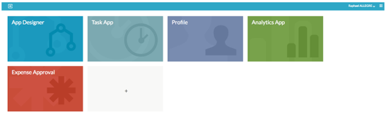

# Create and publish your first process app

Once you’ve created a process, you can create an app and add the process to it, then publish the app.

1.  Click **App Designer** on your dashboard then click the **Apps** tab and select **Create App**.

2.  Give the app a name \(for example “Expense Approval”\) and a description, then click **Create new app definition**.

3.  Click **Edit included models**.

4.  Select the Expense approval model. The  icon shows that you’ve selected it. Then click **Close**.

5.  Click  Save then select the **Publish?** option and **Save and close editor**.

6.  Click  to return to your dashboard.

7.  Click + to add a new app then select the Expense Approval app and click **Deploy**.

    

    The Expense Approval app is added to your dashboard.

    **Next step:** [Use your first process app](gs-use-app.md)

**Parent topic:**[Getting Started with Alfresco Process Services](../topics/getting-started.md)

