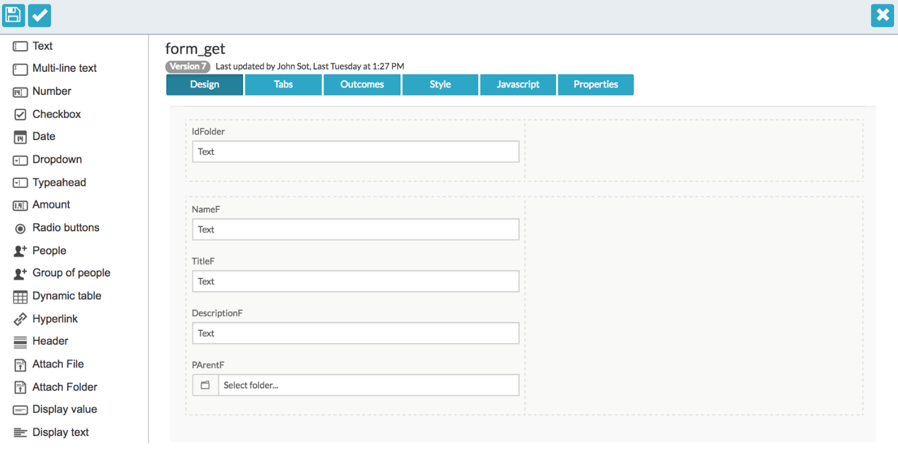
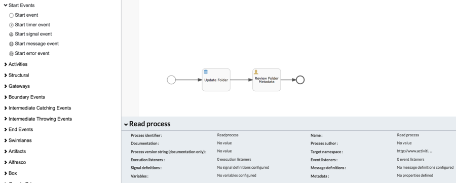
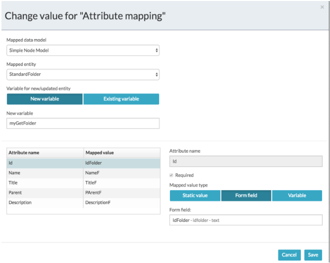

# Updating folder entities

Updating a Alfresco Content Services folder entity is similar to creating one using Store Entity tasks, with different key mapped fields.

1.  In the App Designer create a new or open an existing process in the BPMN Editor.

2.  Select **Start** and click on the reference form.

3.  Create a form similar to those created in [Creating folder entities](ps-create-folder-entity.md).

    

4.  Click **Save and Close** to return to the BPMN Process Editor.

5.  From the Components List of the BPMN Editor, drag and drop a **Store Entity Task**.

    

6.  Click on the **Attribute Mapping** property.

7.  From the Mapping Configuration screen select the relevant data model. In this example the Simple Folder Model is used.

8.  Select a previously created variable holding a folder entity or click **New variable** to store the result of updating the folder entity.

9.  For each folder data model attribute listed in Attribute name, select a form field to use for mapping the form fields to the attributes to be updated.

    Unlike the creation operation, the Id attribute is required to update the folder entity. Alternatively, you can supply the parent folder and name of folder instead of the folder id. When you supply a folder id and folder name this renames the folder.

    

10. Click **Save**.

11. Save the process then publish and deploy the application.

12. In the application start a new process.

13. Select the parent folder of the folder entity and type in the name of the folder you want to update.

14. Type in a new description and title and click **Start Process**.

    You can sign in to Alfresco Share open the folder to see the updated Title and Description.

**Parent topic:**[Using folder entities in process applications](../concepts/ps-folder-entities.md)

