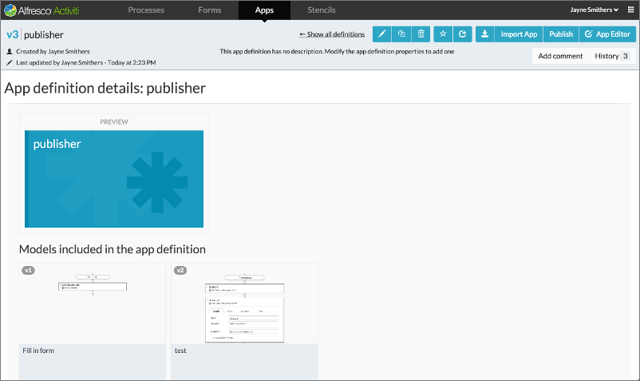

# App Designer editor

Open the App Designer editor by clicking a process definition, reusable form, reusable decision table, app definition, data models, or the stencils tab. The App Designer editor provides features such as copy, comment, delete, add to favorites, share with others, and export. You can also open the corresponding editor to make changes to the content, and perform actions specific to the item type. For example, you can publish an app definition or edit a process.

In the above example, the App Designer editor was opened for an app definition called publisher. The editor always displays the details of the selected item on the top panel along with a set of buttons on the top right. The right-most button opens the editor corresponding to the item displayed. So in the example, the right-most button opens the app editor. If a process definition created via the step editor is opened in the App Designer editor, then the App Editor would open the step editor.

**Parent topic:**[App Designer](../topics/App_Designer_app.md)

