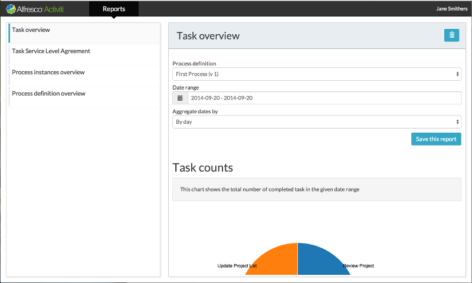
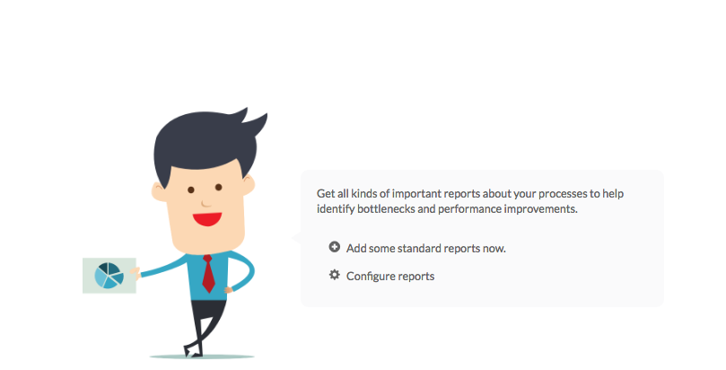

# Analytics App

Use the Analytics App tile to add standard reports and configure custom reports for performance and throughput statistics of your processes. You can view the Analytics App tile only if your account has the Analytics capability. Before generating process reports, make sure to run your processes at least a few times.

When you visit the Analytics app for the first time, you'll see some useful hints on the welcome screen.

The Analytics app has the following tabs:

-   **Reports** - Use this to add standard reports in Alfresco Process Services and view the existing reports.

-   **Configure** - Use this to configure standard reports and custom reports.

-   **[Configuring standard reports](../topics/configuring_standard_reports.md)**  

-   **[Filtering reports](../topics/filtering_reports.md)**  
 You can filter most reports by the following parameters:
-   **[Customizing reports](../topics/customizing_reports.md)**  
 You can customize reports by selecting the Process Status and Date Range parameters. You can also create new reports by modifying the filter option of an existing report and saving it with a new name.

**Parent topic:**[Process Services Landing Page](../concepts/Landing-page.md)

