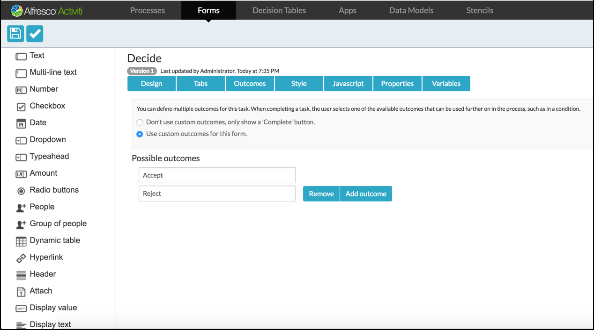
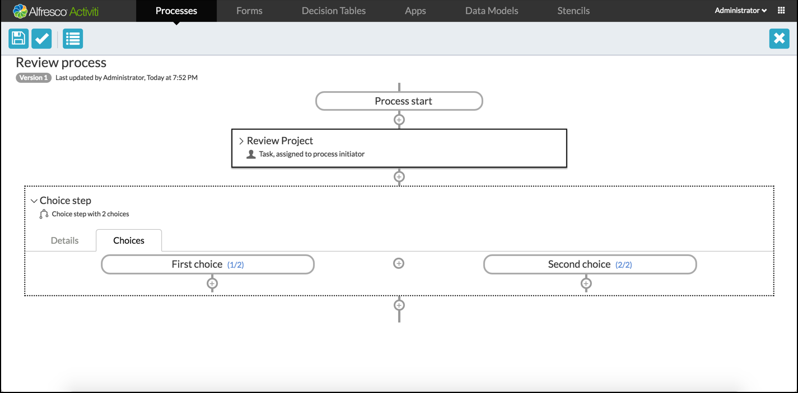
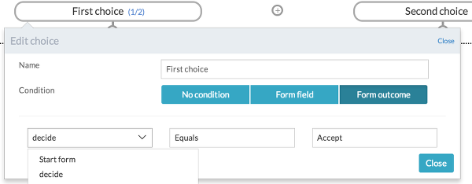
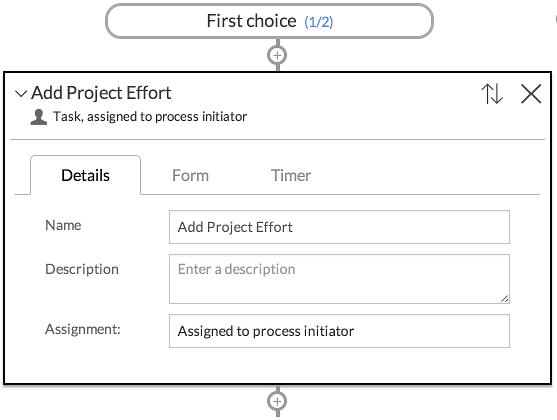
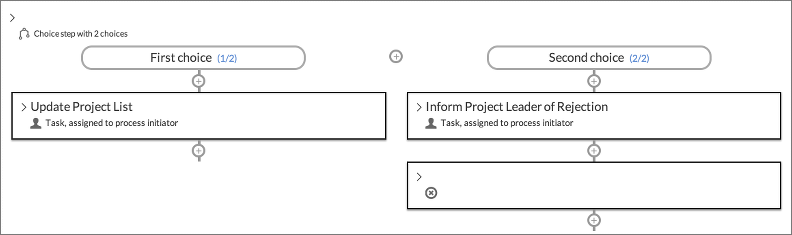
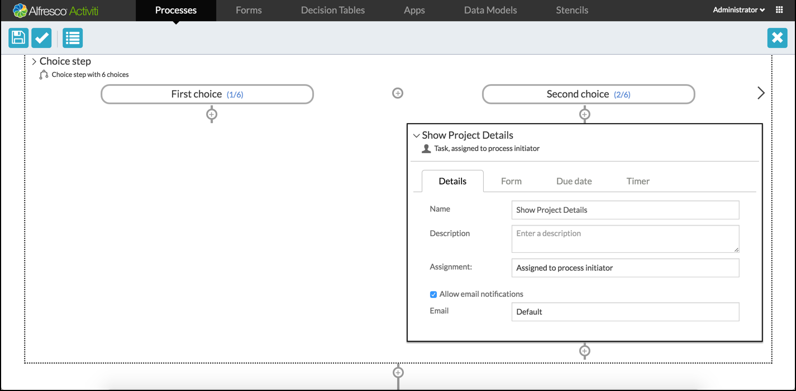
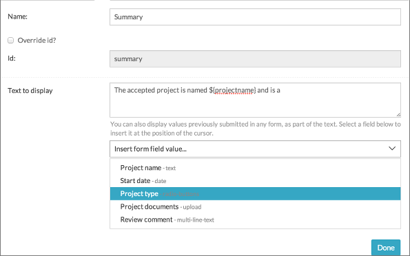
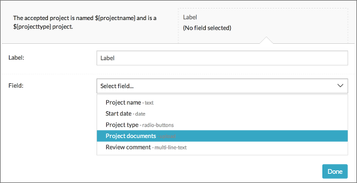
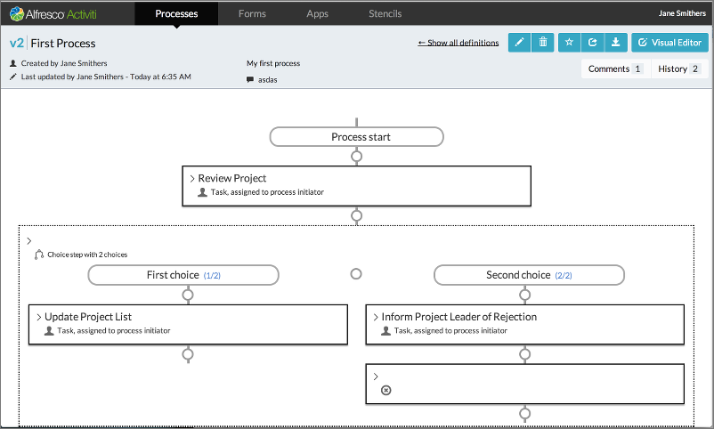

# Assigning tasks to a process

To simplify a process, assign all tasks to the process initiator so that you can run the process and have the tasks assigned to yourself.

1.  Click **Forms** \> **Create Form**. The Create a new form dialog box appears.
2.  Enter a form name and click**Save**.
3.  Drag a multiline text field and drop it to the form. Name the label as **Review comment**.
4.  Click the **Outcomes** tab and then select **Use custom outcomes for this form**.
5.  In **possible outcomes**, add the following outcomes and then save the form:
    -   **Accept**

    -   **Reject**

        

        The next step depends on the outcome selected in the previous step.

6.  Add a **Choice step** by clicking the **+** \(plus\) icon below the **Review Project** step.

    

    You can also add additional choices by clicking the **+** \(plus\) icon in the center of the **Choice step**.

7.  Click the relevant choice box to set the condition for the selected choice. The Edit choice dialog appears where you can select the condition based on the existing form fields or outcomes.
8.  For the first choice, click **Form Outcome** and select the following values: **Review** form \> **Equal** \> **Accept**.

    

9.  Click **Save**. Repeat the same for second choice: **Review form** \> **Equal** \> **Reject**.

    **Note:** Provide a meaningful name for the choice steps if you can.

10. Add a task that should be done once the project review is accepted by clicking the + under the **First choice** box.

    

11. Now, add a simple human task called **Update Project List**. Under the **Second choice** box, add a human task with a name **Inform Project Leader of Rejection**. The aim is for the process to stop when the rejection task is completed. Therefore, add a **Stop step** to the bottom of this task.

    

12. Continue with adding steps to the **First choice**, or in this case continue to add them after completing the Choice step by clicking the **+** at the very bottom. We’ll just add a Human task with the name Show Project Details.

    

13. On the **Forms** tab for this task, create a new form. Drag a **Display text** field from the palette and enter the text message to display. The text can contain references to values added by a user in previous forms. There is a helper drop down that you can select from to insert the given reference at the cursor position in the text.

    

14. Add some text as shown. Then drag a **Display value** field from the palette and set it to display the project files by selecting the appropriate field from the list.

    

15. Save the form to return to the **Step Editor**. In addition, save the process model you’ve just designed.

All your processes are listed with a thumbnail of the process. You can edit a process from the list by clicking **Visual Editor**. For any additional information about a model, click the thumbnail itself or the **Show Details** button on the top right corner of the thumbnail. This takes you to the **Details** page for the process model where you can see the preview model as well as the actions that you can perform on it.

**Tips**:

-   When you edit and save a model, you can choose for the changes to be saved as a new version.

-   Previous versions can be accessed from the **History** popup, as can any commentary from the **Comments** popup, where you can add further comments.

-   Other action buttons are self-explanatory such as deleting, starring \(favorites\), sharing, and downloading the model.

**Parent topic:**[Creating a process model](../topics/creating_a_process_model.md)

