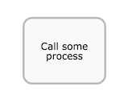

# Call activity

A call activity is used to execute another process definition as part of the current process instance.

The main difference between a sub-process and a call activity is that the call activity does not share context with the process instance. Process variables are explicitly mapped between the process instance and the call activity.

A call activity is visualized as a rounded rectangle with a thick border.

|Property|Description|
|--------|-----------|
|Id

|A unique identifier for this element.

|
|Name

|A name for this element.

|
|Documentation

|A description of this element.

|
|Called element

|This is the identifier of the process definition that should be called.

|
|In parameters

|Configures the process variables that are mapped into the called process instance when it’s executed. It’s possible to copy values directly \(using the *source* attribute\) or with an expression \(using the *source expression* attribute\) in a *target* variable of the called process instance.

|
|Out parameters

|Configures the process variables that are mapped from the called process instance into the parent process instance.

|
|Asynchronous

|\(Advanced\) Define this task as asynchronous. This means the task will not be executed as part of the current action of the user, but later. This can be useful if it’s not important to have the task immediately ready.

|
|Exclusive

|\(Advanced\) Define this task as exclusive. This means that, when there are multiple asynchronous elements of the same process instance, none will be executed at the same time. This is useful to solve race conditions.

|
|Execution listeners

|Execution listeners configured for this instance. An execution listeners is a piece of logic that is not shown in the diagram and can be used for technical purposes.

|
|Multi-Instance type

|Determines if this task is performed multiple times and how. The possible values are:

 -   **None**

The task is performed once only.

-   **Parallel**

The task is performed multiple times, with each instance potentially occurring at the same time as the others.

-   **Sequential**

The task is performed multiple times, one instance following on from the previous one.

|
|Cardinality \(Multi-instance\)

|The number of times the task is to be performed.

|
|Collection \(Multi-instance\)

|The name of a process variable which is a collection. For each item in the collection, an instance of this task will be created.

|
|Element variable \(Multi-instance\)

|A process variable name which will contain the current value of the collection in each task instance.

|
|Completion condition \(Multi-instance\)

|A multi-instance activity normally ends when all instances end. You can specify an expression here to be evaluated each time an instance ends. If the expression evaluates to true, all remaining instances are destroyed and the multi-instance activity ends.

|

**Parent topic:**[Structural components](../topics/structural_components.md)

