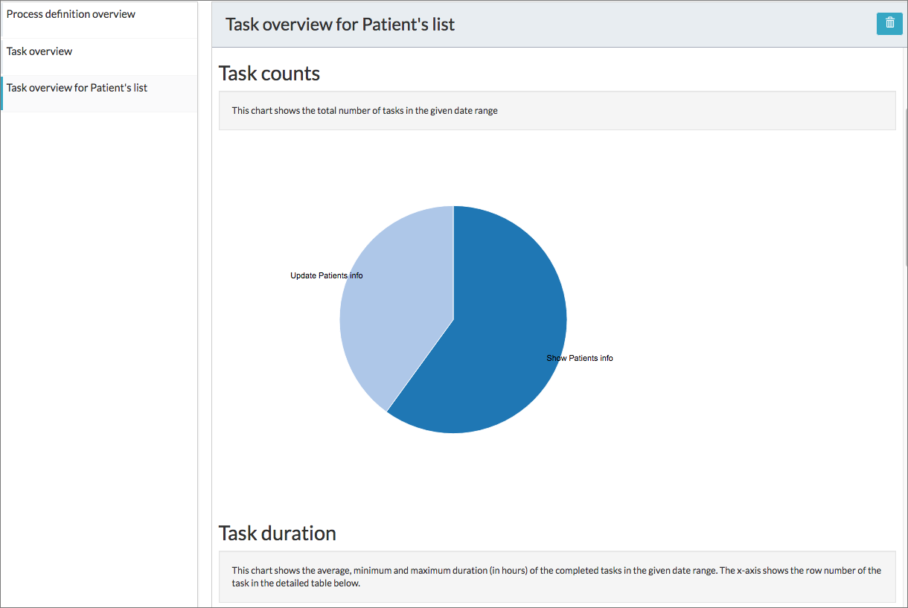

# Customizing reports

You can customize reports by selecting the Process Status and Date Range parameters. You can also create new reports by modifying the filter option of an existing report and saving it with a new name.

**To generate and save a Task overview report:**

1.  Sign in to Alfresco Process Services as a user with Administrator privileges.
2.  Click **Analytics App** \> **Configure** and then Task overview.
3.  Select from the following filter options:
    -   **Process Definition** - Process definitions for the selected user.

    -   **Date Range** - Tasks from Today, Yesterday, Last 7 days, Previous month, Current year, or Custom Range.

    -   **Task Status** - All tasks, Active, or Complete.

    -   **Aggregate dates by** - Tasks by hour, day, week, month, or year.

        Relevant data for Task Counts, Task counts by assignee, Number of tasks divided by date interval, Task Duration, and statistics of all tasks are presented in graphical, tabular, and table formats. In addition, there’s an option to view the previous chart data in a table format.

4.  Click **Export Data** to generate the report in csv format.
5.  Optionally, to save the report with the selected filter options, click**Save this report**. You can also choose to save the report by a new name for easy identification. For example, if your report is specific to a task called Patients List, you could save the report as Task overview for Patients' list.

You can generate all other reports in the same way by using the appropriate filter options. You are now ready to explore the advanced reporting and analytic features in Alfresco Process Services.

**Parent topic:**[Analytics App](../topics/analytics_app.md)

