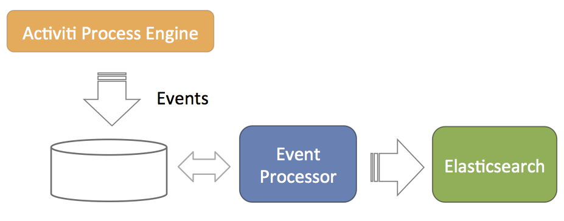

# Event Processing for analytics

The event processing is closely related to the [Elasticsearch configuration](elasticsearch_configuration.md). The main concept is depicted in the diagram below.

1.  The Process Engine is configured to generate events related to process execution \(for example, processes started, task completed, and so on\). These events are stored in the database such that there is no problem with database transactions. Meaning, writing the events to the database succeeds or fails with the regular process execution data.
2.  A component called *event processor* will asynchronously check for new entries in the database table for the events. The events will be processed and transformed to JSON.
3.  The JSON event is asynchronously sent to Elasticsearch. From that point on the data will show up in the reports.

The event processor is architected to work without collisions in a multi-node clustered setup. Each of the event processors will first try to lock events before processing them. If a node goes down during event processing \(after locking\), an *expired events processor* component will pick them up and process them as regular events.

The event processing can be configured, however leaving the default values as they are helps cater for typical scenarios.

|Property

|Description

|Default

|
|event.generation.enabled

|Set to false if no events need to be generated. Do note that the reporting/analytics event data is then lost forever.

|true

|
|event.processing.enabled

|Set to false to not do event processing. This can be useful in a clustered setup where only some nodes do the processing.

|true

|
|event.processing.blocksize

|The number of events that are attempted to be locked and fetched to be processed in one transaction. Larger values equate to more memory usage, but less database traffic.

|100

|
|event.processing.cronExpression

|The cron expression that defines how often the events generated by the Process Engine are processed \(that is, read from the database and fed into Elastic Search\). By default 30 seconds. If events do not need to appear quickly in the analytics, it is advised to make this less frequent to put less load on the database.

|0/30 \* \* \* \* ?

|
|event.processing.expired.cronExpression

|The cron expression that defines how often *expired* events are processed. These are events that were locked, but never processed \(such as when the node processing them went down\).

|0 0/30 \* \* \* ?

|
|event.processing.max.locktime

|The maximum time an event can be *locked* before it is seen as expired. After that it can be taken by another processor. Expressed in milliseconds.

|600000

|
|event.processing.processed.events.action

|To keep the database table where the Process Engine writes the events small and efficient, processed events are either moved to another table or deleted. Possible values are *move* and *delete*. Move is the safe option, as it allows for reconstructing the Elasticsearch index if the index was to get corrupted for some reason.

|move

|
|event.processing.processed.action.cronExpression

|The cron expression that defines how often the action above happens.

|0 25/45 \* \* \* ?

|

**Parent topic:**[Elasticsearch configuration](../topics/elasticsearch_configuration.md)

