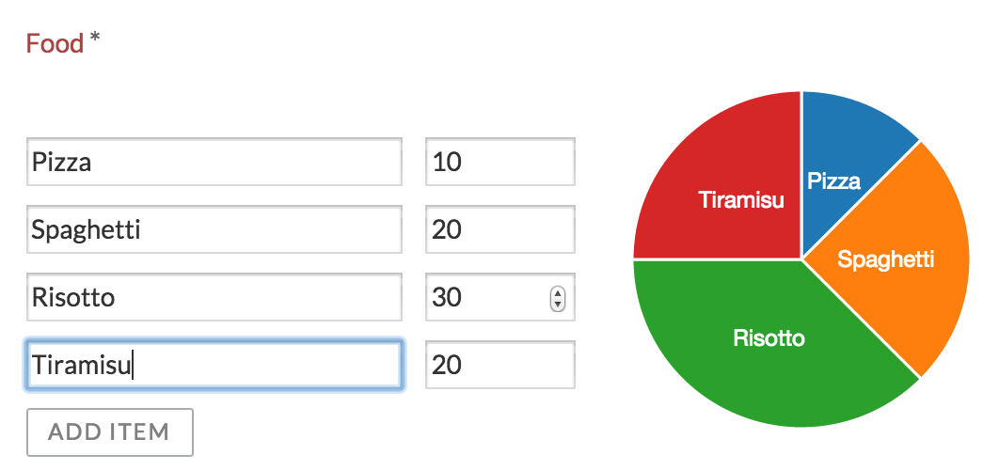

# Example 3: Dynamic pie chart

This example is more advanced then the previous two: is contains a simple list of number fields with a button at the bottom to add a new line item, while generating a pie chart on the right.

We’ll use the [*Epoch* library](https://github.com/fastly/epoch) as an example here. Download the following files from its Github site:

-   [d3.min.js](https://raw.githubusercontent.com/mbostock/d3/v3.5.6/d3.min.js)

-   [epoch.min.js](https://raw.githubusercontent.com/fastly/epoch/0.6.0/epoch.min.js)


Create a new form stencil item and name it "Chart". Scroll down to the *Script library imports* section, and upload the two libraries. At run-time, these third party libraries will be included when the form is rendered.

**Note: The order in which the third party libraries are defined is important. Since the Epoch library depends on d3, d3 needs to be first in the table and epoch second \(as that is the order in which they are loaded at run-time\).**

The *Form editor template* is the easy part. We could just use an image of a pie chart here.

```
</img>
```

First define the controller for this form field type. The controller is an AngularJs controller, that does mainly three things:

-   Keep a model of the line items

-   Implement a callback for the button that can be clicked

-   Store the value of the form field in the proper format of Alfresco Process Services


```
angular.module('activitiApp')
    .controller('MyController', ['$rootScope', '$scope', function ($rootScope, $scope) {

        console.log('MyController instantiated');

        // Items are empty on initialisation
        $scope.items = [];

        // The variable to store the piechart data (non angular)
        var pieChart;

        // Epoch can't use the Angular model, so we need to clean it
        // (remove hashkey etc, specific to Angular)
        var cleanItems = function(items) {
            var cleanedItems = [];
            items.forEach(function(item) {
               cleanedItems.push( { label: item.label, value: item.value} );
            });

            return cleanedItems;
        };

        // Callback for the button
        $scope.addItem = function() {

            // Update the model
            $scope.items.push({ label: 'label ' + ($scope.items.length + 1), value: 0 });

            // Update the values for the pie chart
            // Note: Epoch is not an angular lib so doesn't use the model directly
            if (pieChart === undefined) {

                pieChart = jQuery('.activiti-chart-' + $scope.field.id).epoch({
                    type: 'pie',
                    data: cleanItems($scope.items)
                });
                console.log('PieChart created');

            } else {

                $scope.refreshChart();

            }

        };


        // Callback when model value changes
        $scope.refreshChart = function() {
            pieChart.update(cleanItems($scope.items));
            console.log('PieChart updated');
        };


        // Register this controller to listen to the form extensions methods
        $scope.registerCustomFieldListener(this);

        // Deregister on form destroy
        $scope.$on("$destroy", function handleDestroyEvent() {
            console.log("destroy event");
            $scope.removeCustomFieldListener(this);
        });

        // Setting the value before completing the task so it's properly stored
        this.formBeforeComplete = function(form, outcome, scope) {
            console.log('Before form complete');
            $scope.field.value = JSON.stringify(cleanItems($scope.items));
        };

        // Needed when the completed form is rendered
        this.formRendered = function(form, scope) {
            console.log(form);
            form.fields.forEach(function(field) {
                if (field.type === 'readonly'
                      && $scope.field.id == field.id
                      && field.value
                      && field.value.length > 0) {

                    $scope.items = JSON.parse(field.value);
                    $scope.isDisabled = true;

                    pieChart = jQuery('.activiti-chart-' + $scope.field.id).epoch({
                        type: 'pie',
                        data: cleanItems($scope.items)
                    });

                }
            });
        };

}]);
```

The *Form runtime template* needs to reference this controller, use the model and link the callback for the button:

```
<link rel="stylesheet" type="text/css" href="https://cdnjs.cloudflare.com/ajax/libs/epoch/0.6.0/epoch.min.css">

<div ng-controller="MyController" style="float:left;margin: 35px 20px 0 0;">
    <div ng-repeat="item in items">
          <input type="text" ng-model="item.label" style="width:200px; margin: 0 10px 10px 0;" ng-change="refreshChart()">
          <input type="number" ng-model="item.value" style="width: 80px; margin-bottom: 10px;" ng-change="refreshChart()">
    </div>

    <div>
        <button class="btn btn-default btn-sm" ng-click="addItem()" ng-disabled="isDisabled">
           Add item
        </button>
    </div>
</div>

<div class="epoch category10" ng-class="'activiti-chart-' + field.id" style="display:inline-block;width: 200px; height: 200px;"></div>
<div class="clearfix"></div>
```

At run-time, the following will be rendered:



**Parent topic:**[Custom form fields](../topics/custom_form_fields.md)

